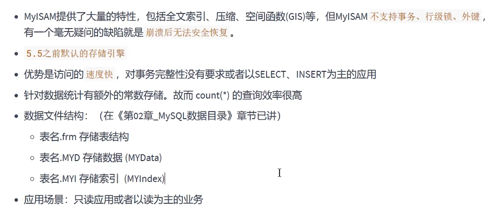
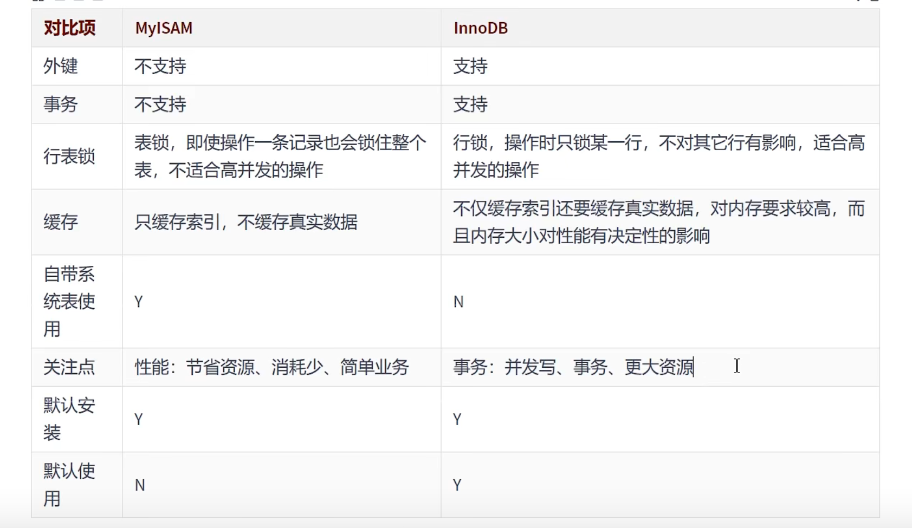

# Mysql存储引擎
**存储引擎就是指表的类型**  
1.查看mysql存储引擎  
```show engines;```  
默认是InnoDB 

* 修改默认的存储引擎
SET DEFAULT_STORAGE_ENGINE=MyISAM;   
* 或者修改my.cnf文件

2.创建表的时候可以指定存储引擎


# InnoDB引擎:具备外键支持功能的事务存储引擎
平常工作中，用外键效率低，插入修改笔记麻烦，会影响性能  
**我们选择InnoDB是因为它支持事务**,确保事务的完整提交和回滚
1. InnoDB表的优势(为处理巨大数据量的最大性能设计，并发量大)
比如操作便利、提高了数据库的性能、维护成本低  
除了增加和查询外，还需要更新、删除操作，应优先选择InnoDD  
除非有非常特别的原因需要使用其他的存储引擎，否则应该优先考虑InnoDB引擎
2. InnoDB的缺点  
写的处理效率差一些，要占用更多的磁盘空间来保存数据和索引  
MyISAM只缓存索引，InnoDB索引和数据都缓存，所以对内存要求高
# MyISAM引擎:主要的非事务处理存储引擎


# MyISAM和InnoDB的区别


# 其他引擎
Archive引擎:用于数据存档    
  
Blackhole引擎:丢弃写操作，读操作会返回空内容
  
CSV引擎：存储数据时，以逗号分隔各个数据项
