# 1.索引的数据结构
###### 1.索引概述
**索引的本质：** 索引是数据结构，可以理解为排好序的快速查找数据结构
索引是在存储引擎中实现的，在InnoDB中是B+树，同时存储引擎可以定义每个表的最大索引数和最大索引长度

索引的作用相当于图书的目录，可以根据目录中的页码快速找到所需的内容。

一个索引是存储的表中一个特定列的值数据结构。索引是在表的列上创建。要记住的关键点是索引包含一个表中列的值，并且这些值存储在一个数据结构中。请牢记这一点：索引是一种数据结构。一个好的数据库表设计,从一开始就应该考虑添加索引,而不是到最后发现慢SQL了,影响业务了才来补救     


###### 2.优点
1) 降低数据库的IO成本，这也是创建索引最主要的原因
2) 唯一索引，保证数据唯一性
3) 外键，加速表和表之间的连接，联合查询时可以提高查询效率
4) 在使用分组和排序子句进行数据查询时，可以显著减少时间，降低CPU消耗，因为它是排好序的快速查找数据结构,排序就不用说了，分组的时候快是因为附近的元素如果有相同数值的，就能很快的分为一组，也是由于已经排好序了  
###### 3.缺点
1) 创建和维护索引需要耗费时间
2) 占磁盘空间
3) 降低表更新的速度，因为要动态维护索引,
```这种情况下，先删除表中的数据，然后插入数据后再创建索引```
---
# InnoDB中的索引方案
**B+树**   
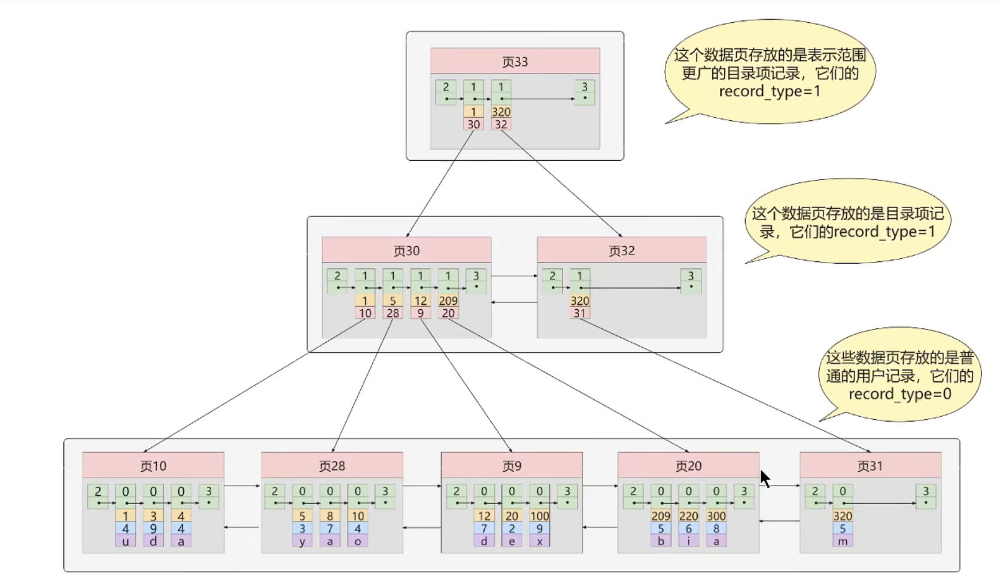
最下面一层存放实际的记录。一般情况下，我们用到的B+树都不会超过4层，IO次数减少，时间减少很多，又因为每个页面有页目录，可以用二分法快速定位记录，一个数据页默认为16kb  
---
##### 常见索引概念

1. 聚簇索引   
```索引即数据，数据即索引```  
   
**特点**  
   1. 使用记录主键值的大小进行记录和页的排序
   * 页内的记录按主键大小顺序排成一个单向链表
   * 各个存放用户记录的页也是根据主键大小排成一个双向链表
   * 存放目录项记录的页分为不同的层次，在同一层次中的页也是根据页中目录项记录的主键大小排序排成一个双向链表
   2. B+树的叶子节点存储的是完整的用户记录    


**优点**
* 数据访问更快,因为索引和数据保存在同一B+树
* 查找速度快
* 节省大量IO操作  

**缺点**  
* 插入速度慢，要排序，所以一般都是采用自增ID为主键
* 更新主键得重新排序，所以一般定义为主键不可更新
* 二级索引访问需要两次索引查找  

**限制**  
* 只有InnoDB才有聚簇索引,MyISAM没有
* 每个表只能有一个聚簇索引，因为物理存储排序方式只有一种
* 主键尽量选择有序的顺序id
---
2.二级索引(辅助索引，非聚簇索引)  
以其他列的大小作为排序规则，多建几颗B+树，叶子节点只存放c2和c1两个列，如果要找完整的记录就要回表，通过c2列的值确定要查找记录的主键值，然后回到聚簇索引B+树查找完整的数据  
---
3.联合索引(也是非聚簇索引)  
每条目录项记录由c2、c3、页号三部分组成，首先按c2值排序，如果c2相同，则按c3值排序， B+树叶子节点里面存储的只有c2,c3,主键c1的值  

---
## InnoDB的B+树索引的注意事项  
1.**实际上这个构建B+树的过程是自顶向下的，根节点是不动的**
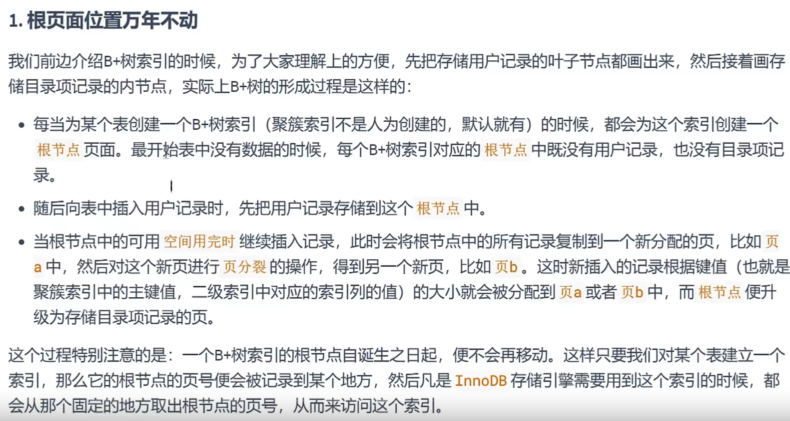  

2. 内节点中目录项记录的唯一性
B+树索引的内节点中目录项记录的内容是索引列加页号的搭配，但是这个搭配对于二级索引不严谨，因为可以重复，不像聚簇索引，有主键唯一性，所以得在目录项加上主键列    

当不唯一的时候，插入数据时就不知道该把数据放到哪个页了，所以对于二级索引的内节点来说的，实际上内节点的目录项记录的内容分三部分
* 索引列的值
* 主键值
* 页号  
添加了主键就是唯一的了       
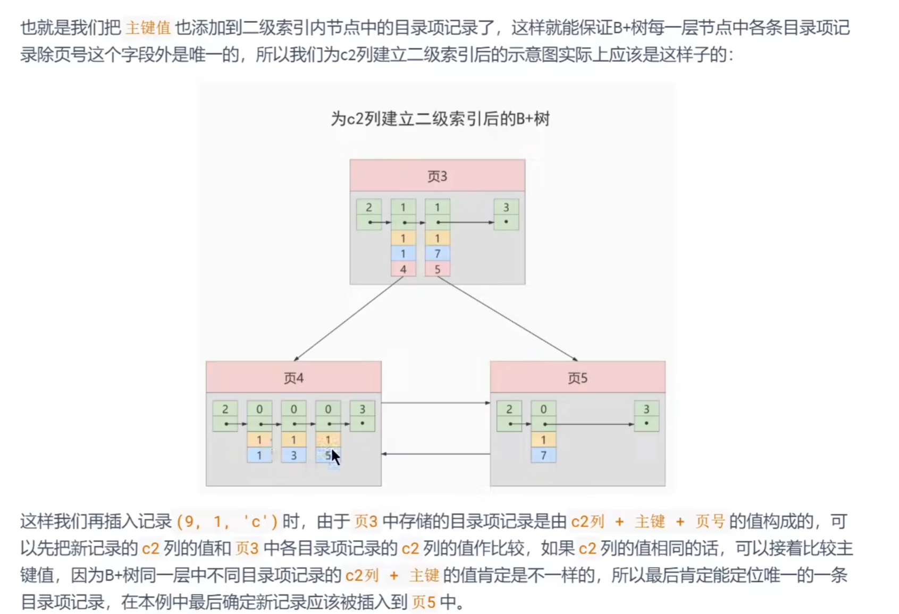    


3. 一个页面最少存储2条记录，要构成二叉树      
    

# MyISAM的索引 
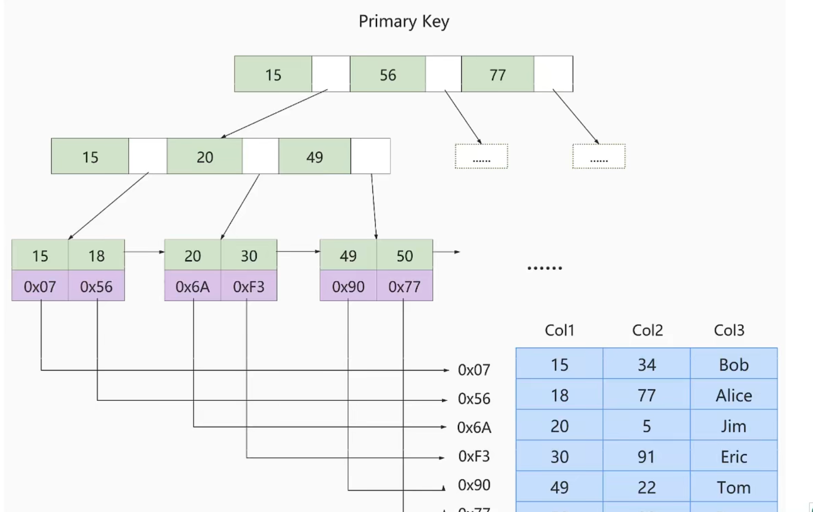  
如图所示，叶子节点存放的是主键值和数据记录地址  
插入数据的时候没有刻意按照主键大小排序  
MyISAM也可以没有主键，反正他没有聚簇索引

# InnoDB和MyISAM的区别
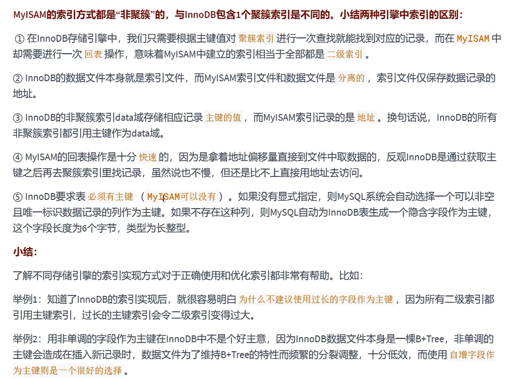

# 索引的代价
  


# Hash结构效率高，那为什么索引结构要设计成树型呢？
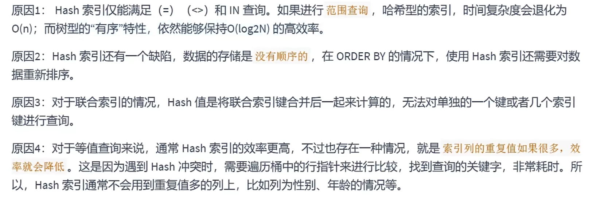  
Redis存储的核心就是Hash表  
**虽然InnoDB本身不支持Hash索引，但是提供自适应Hash索引**  
如果某个数据经常被访问，当满足一定条件时就会将这个数据页的地址存放到Hash表中

# B树和B+树的区别  
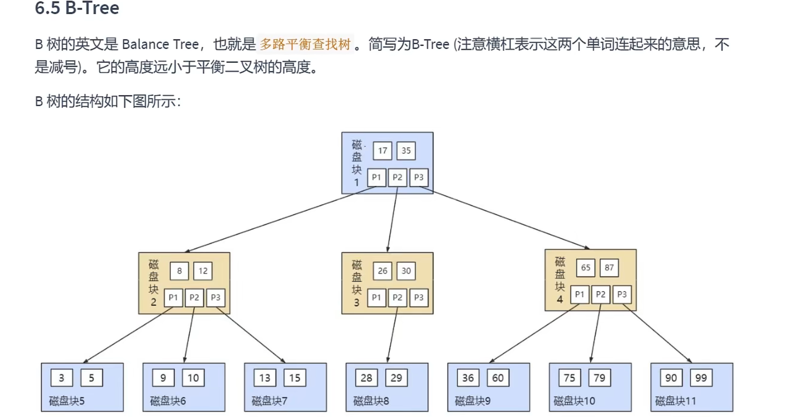  
* B树的每个节点都会有真实的数据信息，B+树只有叶子节点才会有  
* 当前节点不会出现在下一节点，而B+树中每个节点都有索引信息  
* 由于一个页只有16kb，B+树除了叶子节点都不存放具体的数据，所以他一页存放的索引就多，就比B树更矮胖，IO次数为2~4次  

B+树的中间节点并不直接存储数据，这样的好处都有什么呢？  
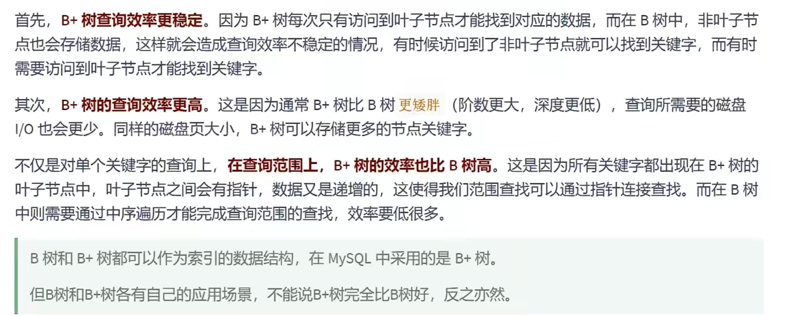

# 思考题
  
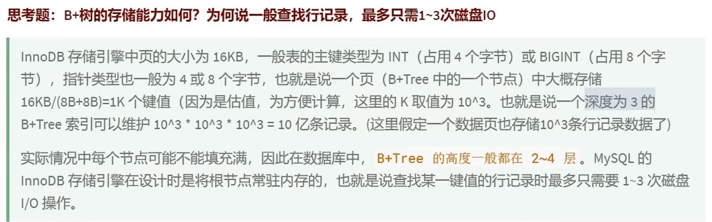  
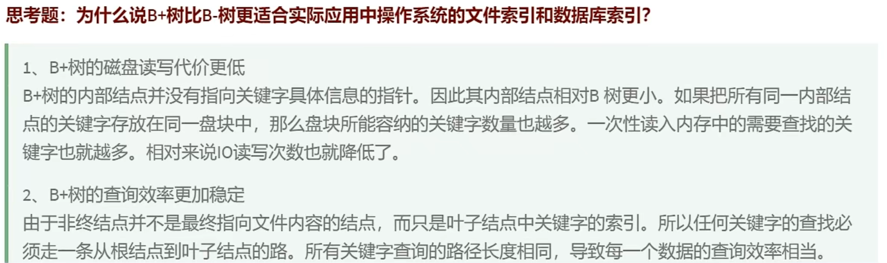  
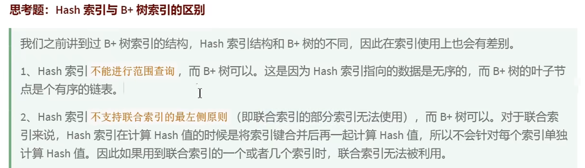  
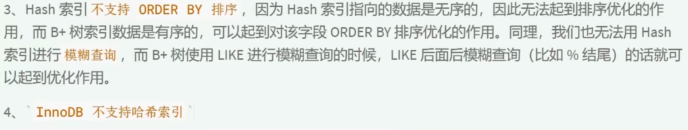  
     
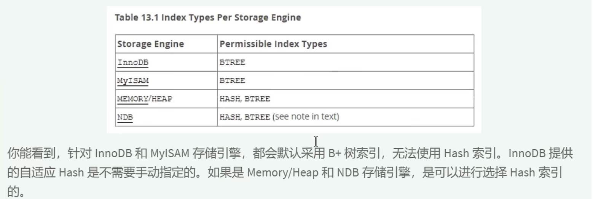  

# 一些自己思考的面试题   
1. Mysql什么时候用索引比不用索引还慢？    
比如说用的是二级索引，然后要查询所有字段，这个时候还不如遍历主键索引来的快，因为二级索引过滤出满足条件的数据，但是如果索引中没有保存其他所有列的值，     
需要回表操作，再去主键索引中找到对应的记录，读了两棵B+树    

