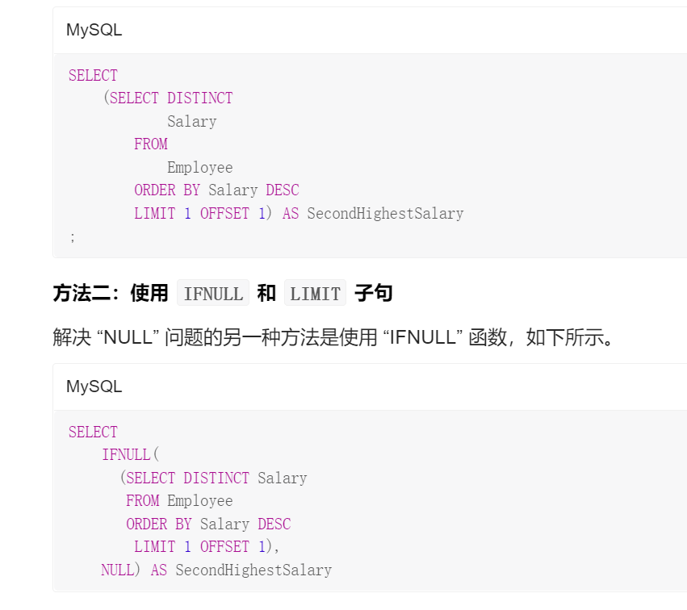

# SQL语句   

#####  列转行,行转列       
列变多是“行转列” 列变少是“列转行”(#^.^#)    
 

力扣1795这题考的是列变行      
    

```mysql
SELECT 

```


a as b 可以理解成， 用 a 作为 b 这一列的值。 比如 store1 as price 就是说在新的表的 price 这一列， 用 store1 在原来表中的值作为值。 而 'store1' as store， 因为加了单引号成了字符串， 所以就是字符串作为新表里 store这一列的值。 前面的所有as去掉也是一样的， 比如 store1 price 也是 store1在老表中的值作为新表中 price 列的值      


----

接下来看如何行转列   

    

```mysql
SELECT
    product_id,
    SUM(IF(store = 'store1', price, NULL)) 'store1',
    SUM(IF(store = 'store2', price, NULL)) 'store2',
    SUM(IF(store = 'store3', price, NULL)) 'store3'
FROM
    Products1
GROUP BY product_id ;

```

或者用CASE WHEN   


   


   


##### 力扣608 树节点   

       


##### 176. 第二高的薪水
   
    


答案： 
第一种是分页查询或者叫嵌套子循环，这样可以符合题意，不存在就返回null，用了临时表的性质   


    

###### IFNULL
     


NULLIF为ORACLE函数   
###### 解析①：limit 和 offset用法      


有的时候我们在学习或者工作中会使用到SQL语句，那么介绍一下limit和offset的使用方法。
mysql里分页一般用limit来实现，例如：

1、select* from user limit 3

表示直接取前三条数据

2、select * from user limit 1,3;

表示取1后面的第2,3,4三条条数据

3、select * from user limit 3 offset 1;

表示取1后面第2,3,4三条条数据

解释：

1、当 limit后面跟一个参数的时候，该参数表示要取的数据的数量

例如 select* from user limit 3 表示直接取前三条数据

2、当limit后面跟两个参数的时候，第一个数表示要跳过的数量，后一位表示要取的数量,例如

select * from user limit 1,3;

就是跳过1条数据,从第2条数据开始取，取3条数据，也就是取2,3,4三条数据

3、当 limit和offset组合使用的时候，limit后面只能有一个参数，表示要取的的数量,offset表示要跳过的数量 。

  


# DOS窗口中的\G \g
\g 的作用是分号和在sql语句中写’;’是等效的    
\G 的作用是将查到的结构旋转90度变成纵向(可以将一个很长的行转为好看的格式) 


**三种方法统计重复：**

1. having ＋聚合函数 > select Email from Person group by Email having count(Email) > 1;

2. 自链接 > select DISTINCT p1.Email from Person p1, Person p2 where p1.Email = p2.Email and p1.Id != p2.Id;

3. 子表查询 > select Email from (select count(1) as t, Email from Person group by Email) r where r.t > 1;   


count 是聚合函数，使用 count(*) 要比count(字段) 要快，省略了判断字段是否为 null 的过程，mysql 对 count(*) 做了优化。    
    

