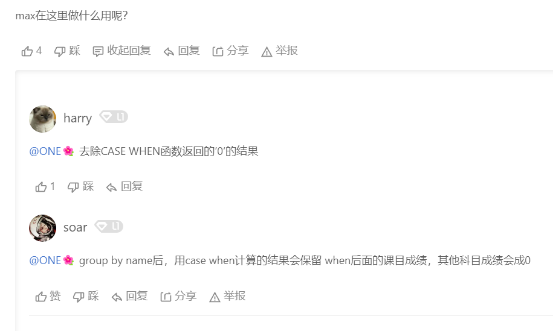

# SQL语句   

### 重点： 列转行,行转列       
列变多是“行转列” 列变少是“列转行”(#^.^#)    
 

力扣1795这题考的是列变行      
    

```mysql
SELECT 

```


a as b 可以理解成， 用 a 作为 b 这一列的值。 比如 store1 as price 就是说在新的表的 price 这一列， 用 store1 在原来表中的值作为值。 而 'store1' as store， 因为加了单引号成了字符串， 所以就是字符串作为新表里 store这一列的值。 前面的所有as去掉也是一样的， 比如 store1 price 也是 store1在老表中的值作为新表中 price 列的值      


----

接下来看如何行转列   

    

```mysql
SELECT
    product_id,
    SUM(IF(store = 'store1', price, NULL)) 'store1',
    SUM(IF(store = 'store2', price, NULL)) 'store2',
    SUM(IF(store = 'store3', price, NULL)) 'store3'
FROM
    Products1
GROUP BY product_id ;

```

或者用CASE WHEN   


   


   