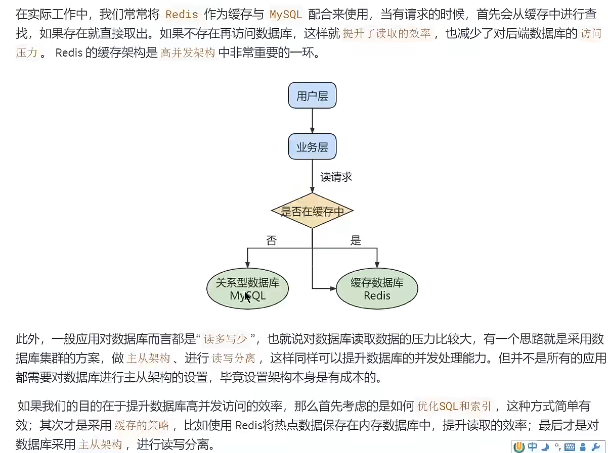
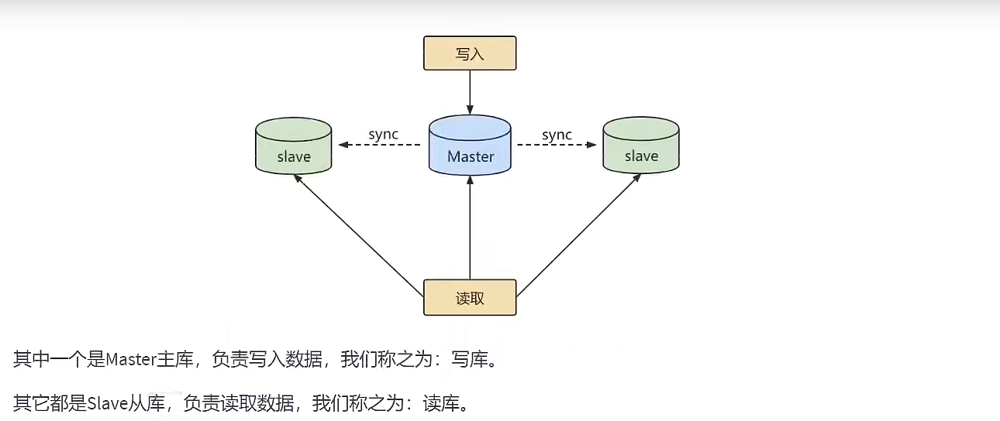

# 主从复制  

# 1. 提高数据库的并发能力  

# 2. 作用  
``可以提高数据库的吞吐量``    
#### 1.读写分离

#### 2.数据备份  
通过主从复制将主库上的数据复制到从库上，热备份机制，主库正常运行的情况下备份到从机，不会影响到服务  
#### 3.具有高可用性
通过数据冗余实现数据的高可用性，当主服务器出现故障和宕机切换到从服务器上，保证服务的正常运行  

# 3.原理  
``slave从master读取binlog来进行数据同步``  

###### 三个线程  
``一个主库线程，两个从库线程``  
* 当从库连接时，主库可以将二进制日志binlog发送给从库，当主库读取事件的时候，会在Binlog上加锁，读取完成后释放锁  
* 从库IO线程向主库发送请求更新binlog，读取更新的部分，并且拷贝到本地的中继日志中  
* 从库SQL线程会读取从库中的中继日志，并且执行日志中的事件，从而保证从库与主库的数据保持同步  
``记得检查MySQL是否开启服务器的二进制日志``

###### 复制三步骤 
* Master将写操作记录了到binlog中，这些记录被称为二进制日志事件  
* Slave将Master的binary log events拷贝到中继日志(relay log)中
* Slave重做中继日志中的事件，将改变应用到自己的数据库中，MySQL复制是异步的且串行化的，而且重启后从切入点开始复制  
###### 复制的问题  
延时
###### 复制的基本原则  
* 每个Slave只有一个master  
* 每个Slave只能有一个唯一的服务器ID
* 每个Master可以有多个Slave  

# 主从搭建看Docker笔记  
