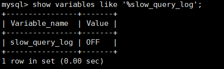
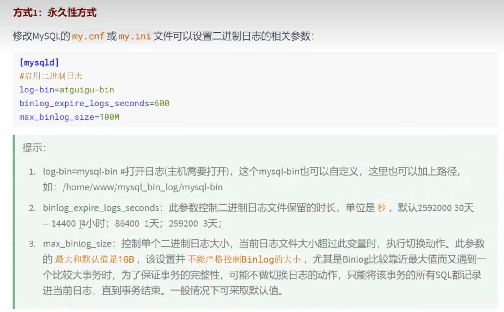

### 日志类型   
除了undo log 和 redo log外还有六个日志   

     

Mysql8.0官网日志地址：<https://dev.mysql.com/doc/refman/8.0/en/server-logs.html>   


二进制日志、错误日志、通用查询日志、慢查询     
8.0之后还增加了中继日志，数据定义语句日志      

   

除了二进制日志(binlog)外，其他日志都是文本文件。默认情况下，所有日志创建于MYSQL数据目录中    


### 日志的弊端   

    


## 慢查询日志(slow query log)   
### 作用   
定位执行慢的SQL

慢查询日志默认是不开启的，如果不是调优需要的话，一般不建议启动该参数，因为开启的话会带来一定的性能影响
###### 4.1 开启慢查询日志参数
1. 查看状态
```mysql
show variables like '%slow_query_log';
```

2. 打开慢查询日志
```mysql
set global slow_query_log = on;
```

3. 查看日志所在位置
```mysql
show variables  like '%slow_query_log%';
```  


4. 设置慢查询的阈值  
     
   上面的方式是临时的，重启mysql后会失效，改配置文件就能永久生效  
   

5. 查询慢查询数目
```mysql
SHOW GLOBAL STATUS  LIKE '%Slow_queries%';
```


6. 慢查询的其他决定参数   
   


7. 慢查询日志分析工具:mysqldumpslow 定位慢查询的sql
   详情看mysqldumpslow --help


8. 关闭慢查询日志  
   生产当中如果不是为了调优可以关闭慢查询，因为会影响我们的性能


9. 删除慢查询日志
```mysql
SHOW VARIABLES LIKE 'slow_query_logs%';
```


## 通用查询日志(general query log)

       

       


```mysql
SHOW VARIABLES LIKE '%general%';   
```

    

   


#### 启动日志   
     
    
    


#### 查看日志   
    
      

#### 停止日志  
     


#### 删除、刷新日志   
   

   


## 错误日志(error log)

    

    

    


       
    


     


    


# 重点：binlog日志(二进制日志)      
    

   

查看记录binlog是否开启：在Mysql8.0中部默认情况下，二进制文件是开启的    
```mysql
SHOW VARIABLES LIKE '%log_bin%';
```

    
参数解析    
     
可以看到有很多binlog文件，因为我们每次mysql重启都会生成一个binlog文件        
    

启动方式       
    
    

    

###### 数据库文件最好不要和日志文件放在同一个磁盘上，这样，当数据库文件所在的磁盘发生故障时，可以使用日志文件恢复数据    

     