# 事务

### 事务概述  
    

   

### ACID
 

  

   
   

### 事务的状态   
    

    

   

### 如何使用事务   
    
   
  

      
   

隐式提交数据的情况   
     

     
       

### 事务的分类   
  
    
   

上述的一些要点提取：  
默认是自动提交的，如果有BEGIN的话，DML自动提交会失效，DDL不会      
     

# 事务隔离级别    
      

### 事务并发问题：    
1. 脏写   

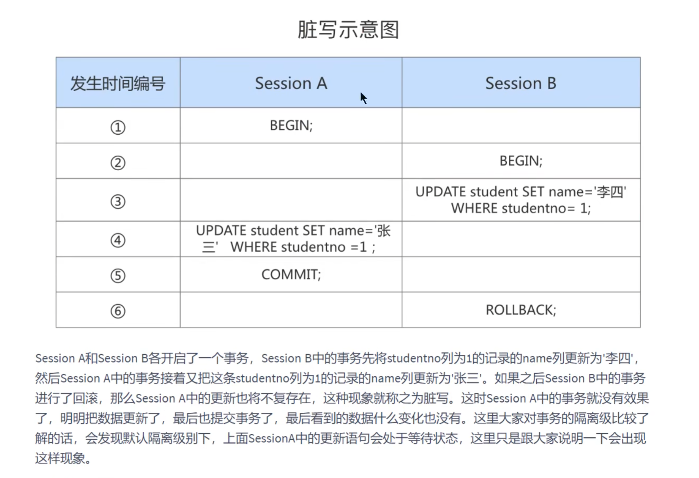    

2. 脏读   
A读取了B更新但是没有提交的数据   
3. 不可重复读   

   

4. 幻读
    
    

### 隔离级别   
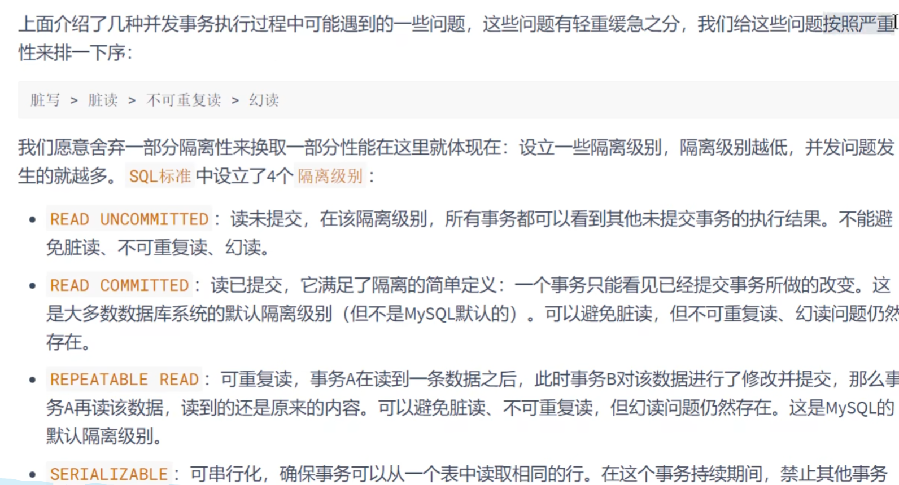

    
Oracle默认是读已提交      
Mysql默认是可重复读    

隔离级别越高并发性能越低       

#### Mysql中的隔离级别    
  

设置隔离级别   
    

      

### 幻读的解决方案   
串行化用了锁，具体在锁和mvcc那边解释   

# 事务日志(redolog undolog)   
      

           

redo_log就是每次内存刷盘之前都会先记录在这个真实存在的文件中，这样就算数据库宕机了也能恢复    

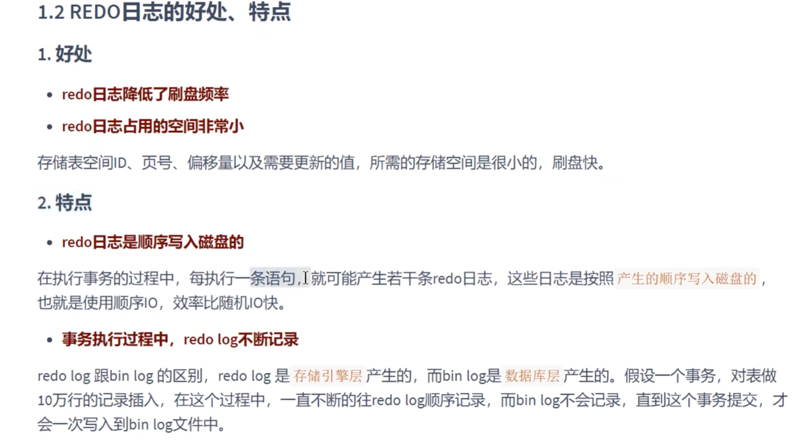      

     

    

    

3号过程不出事就能保证事务持久性      

   
    
0和2实际上丧失了事务ACID的D特性   

  

### 写入redo log buffer 策略和 redo log file     

###### redo log buffer   
   
    

mtr中的操作（log record ）是挨着的，一个事务的多个mtr不一定是挨着的因为各语句可能交替运行的，因为并发   
    

   
    

###### redo log file   
参数设置   
   
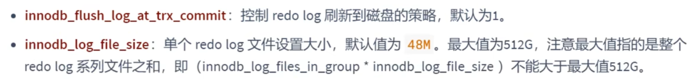   

redo log file大小不够存的时候，会涉及到重复利用和扩容的操作   

2. 日志文件组，重复利用的原理     
     

    

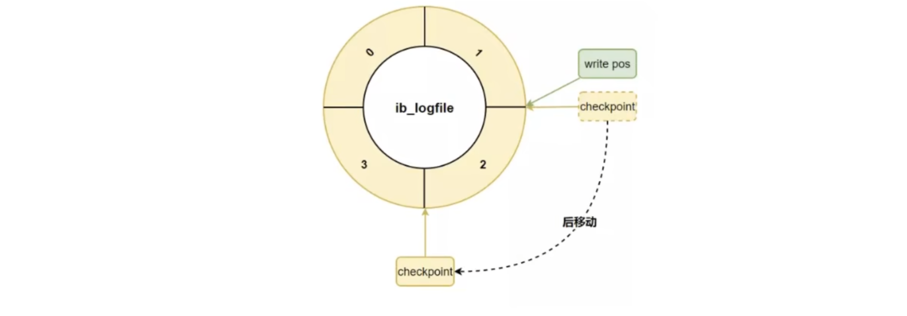    

   
刚开始这两个点都是一个位置，然后写东西，write pos就会后移    

当数据库把内存的数据刷新到磁盘中，再记录在这个redo log file文件就没有必要了，所以checkpoint就后移到那个位置    

总结：   
     

# undo日志   
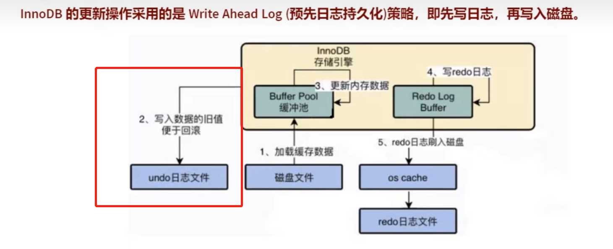    
redo log是持久性的保证，undo log是原子性的保证 ，**在事务中更新数据的前置操作其实是要先写入一个undo log**    

#### 如何理解undo日志  

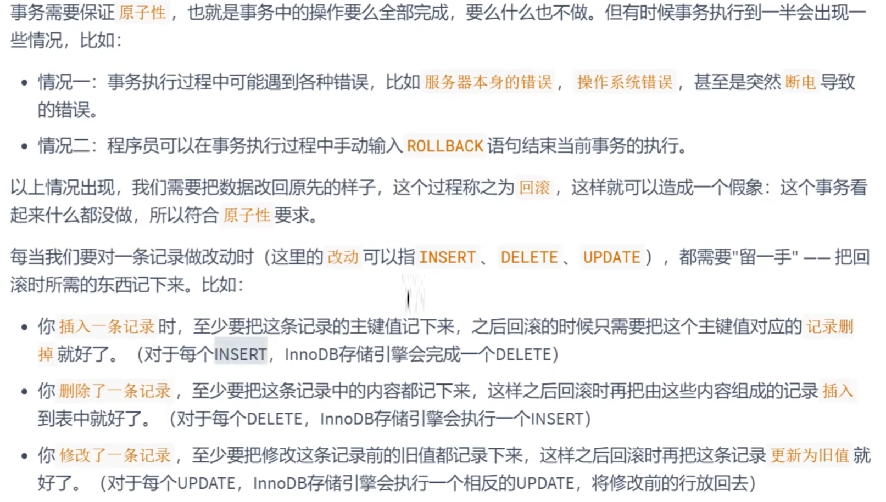    

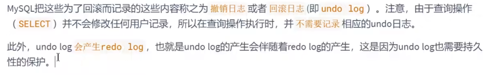    

#### undo log的作用   
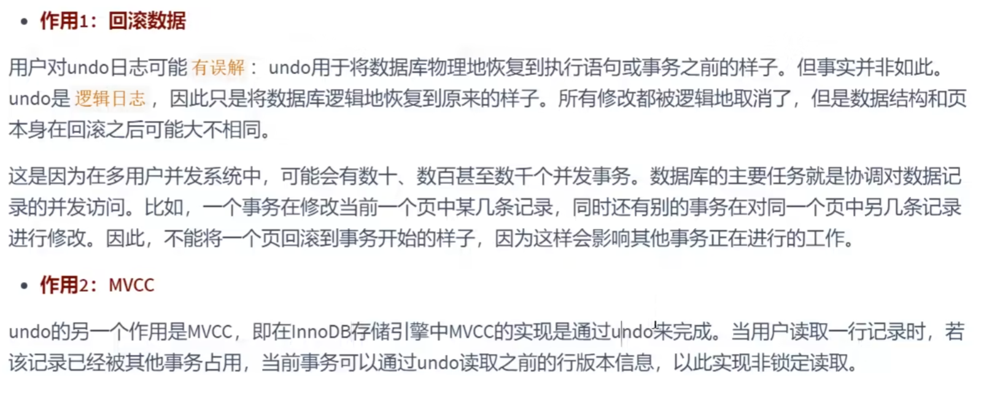    

要注意的是回滚只是逻辑上的，物理上的回滚是不可能的，举个例子，A给B100块，回滚的话是B给A100，而不是说
让A给B100这个操作从未发生过，回到物理结构，修改肯定是发生的了，回滚不可能完全回到最初的模样（在物理层面上）    

#### undo的存储结构   
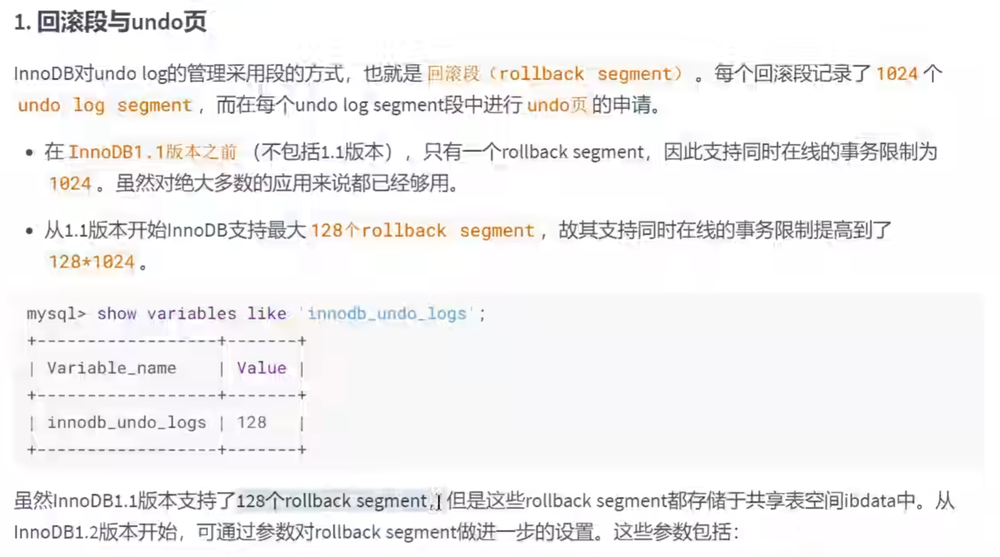    

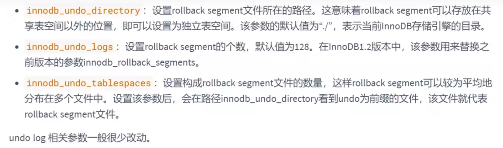    

undo页的重用   
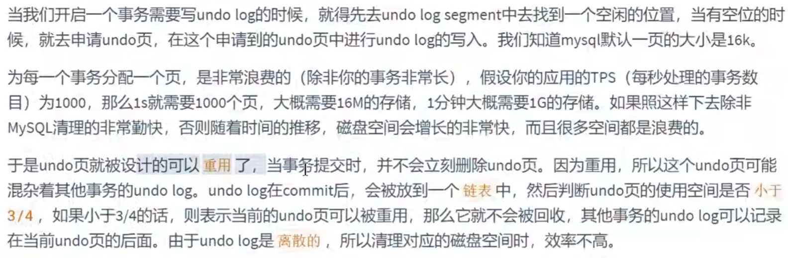   

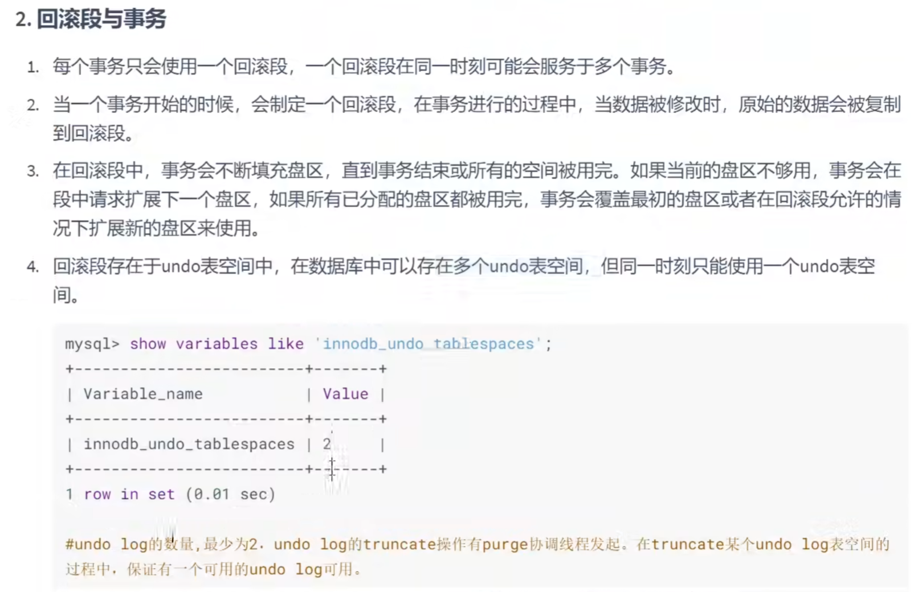   

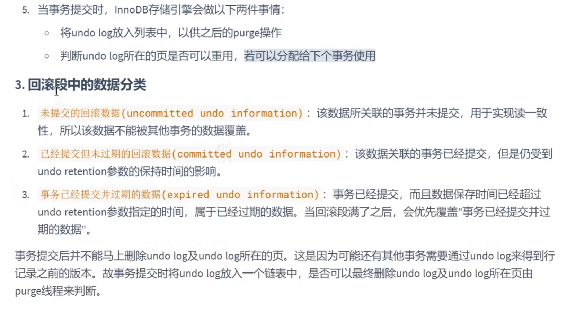    

InnoDB中delete所做删除只是标记为删除的状态，实际上并没有删除掉，因为MVCC机制的存在，要保留之前的版本为并发所使用。最终的删除由purge线程来决定的什么时候来真正删除文件的     

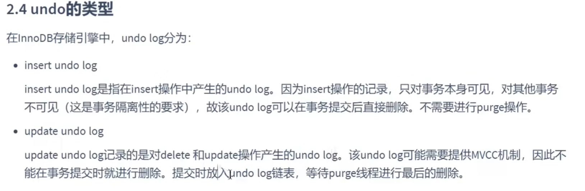     

### undo log的生命周期   
    

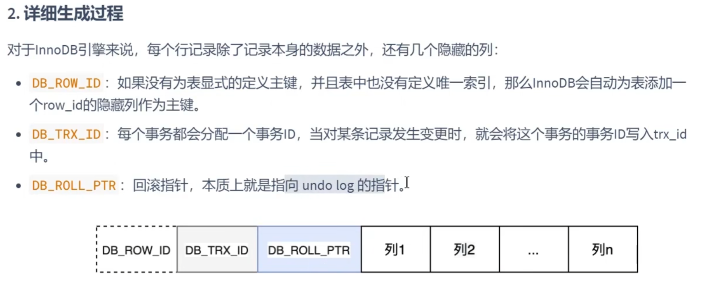   

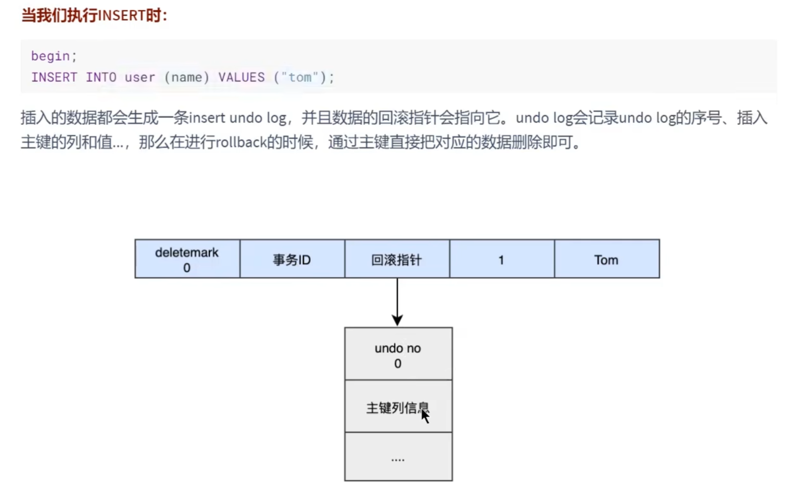    

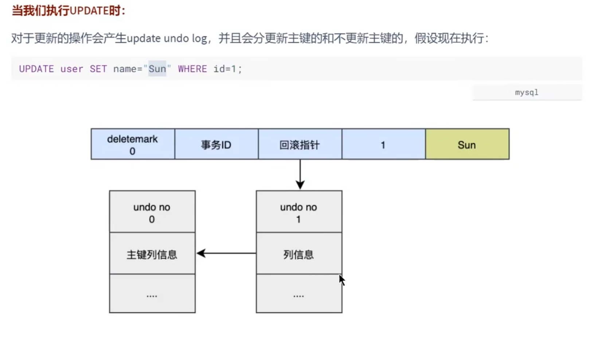   

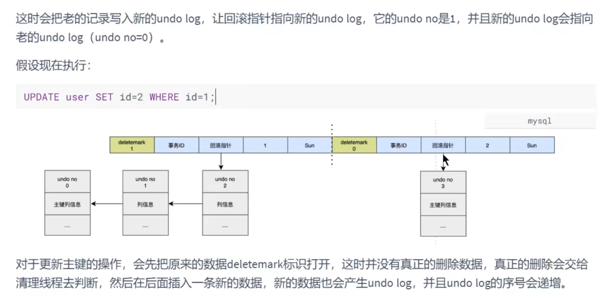    
    
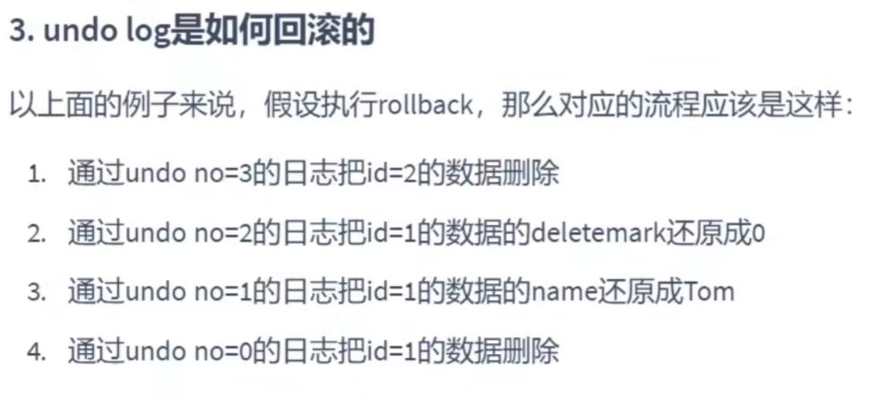     

可以看出，是一个个回滚的，这也是为什么新的undo log要指向旧的undo log的原因   

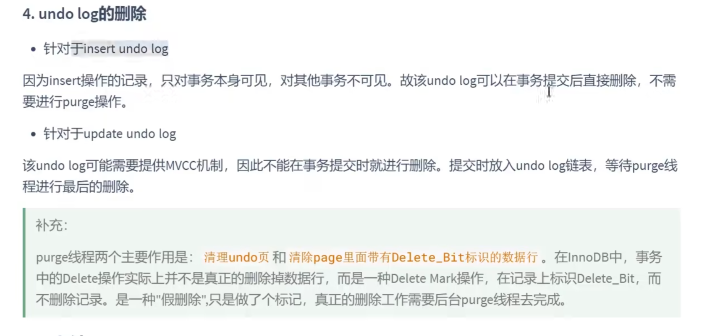     

对数据的删除只是假删除，deletemark从0 变 1，只是标记而已，真正的删除是由purge完成的     

 