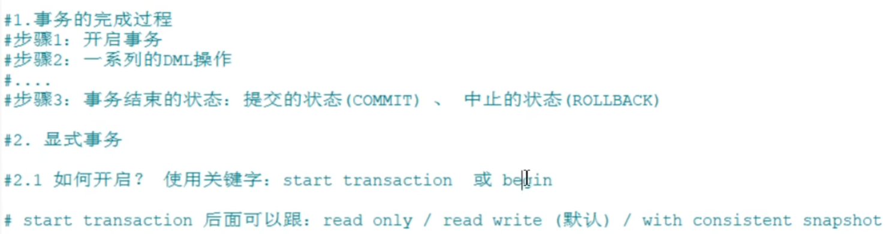
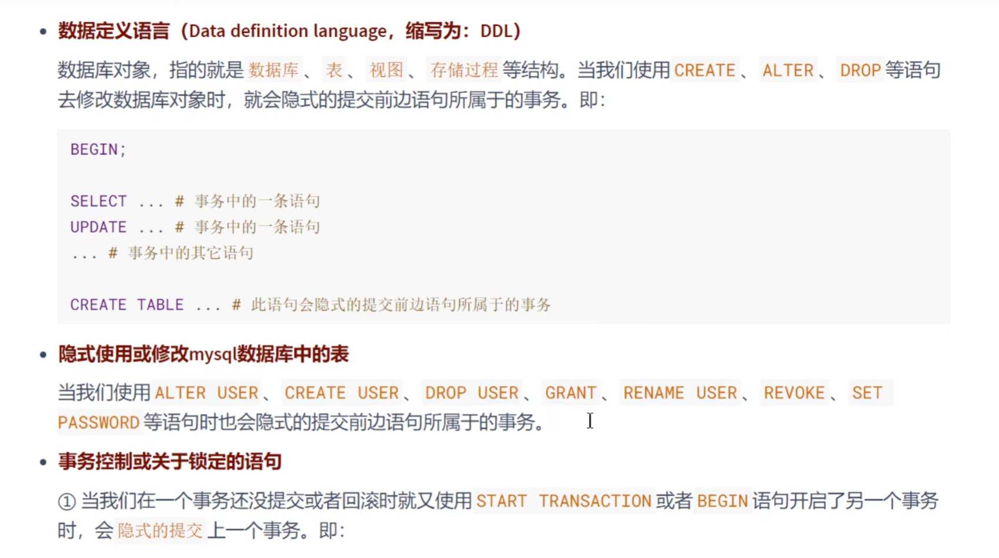
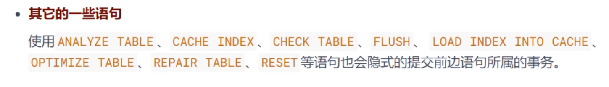

# 事务

### 事务概述  
    

   

### ACID
 

  

   

### 事务的状态   
    

    

   

### 如何使用事务   
    
   
  

      
   

隐式提交数据的情况   
     

     
       

### 事务的分类   
  
    
   

上述的一些要点提取：  
默认是自动提交的，如果有BEGIN的话，DML自动提交会失效，DDL不会      
    