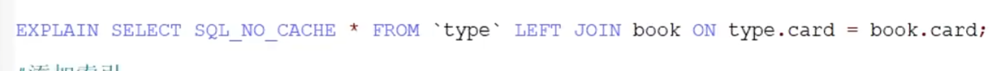
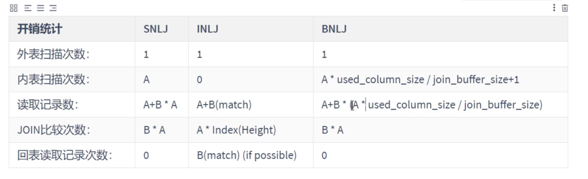
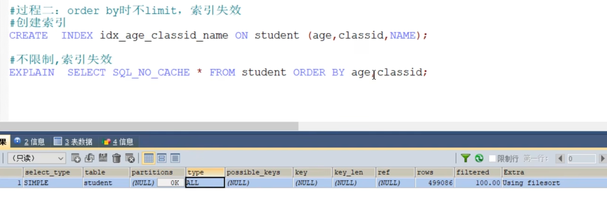

# 本章重点在索引优化和查询优化   


# 1.数据库优化步骤  
  
    
  

### 2.查看系统性能参数  
```mysql
#一个是全局的，一个是当前会话级别的
SHOW [GLOBAL|SESSION]STATUS  LIKE '参数';
```  
   
    
  
   
### 3.统计SQL的查询成本：last_query_cost  
这个查询成本对应的是SQL语句所需要读取的页的数量  
  
     

使用场景：对于比较开销是非常有用的，特别是我们有好几种查询方式可选的时候。
  

  
### 4.定位执行慢的SQL:慢查询日志
默认不开启，如果不是调优需要的话，一般不建议启动该参数，因为开启的话会带来一定的性能影响  
###### 4.1 开启慢查询日志参数  
1. 查看状态  
```mysql
show variables like '%slow_query_log';
```
  
2. 打开慢查询日志  
```mysql
set global slow_query_log = on;
```
  
3. 查看日志所在位置  
```mysql
show variables  like '%slow_query_log%';
```  
  
  

4. 设置慢查询的阈值  
  
上面的方式是临时的，重启mysql后会失效，改配置文件就能永久生效  

  
5. 查询慢查询数目 
```mysql
SHOW GLOBAL STATUS  LIKE '%Slow_queries%';
```


6. 慢查询的其他决定参数   
   


7. 慢查询日志分析工具:mysqldumpslow 定位慢查询的sql
详情看mysqldumpslow --help


8. 关闭慢查询日志  
生产当中如果不是为了调优可以关闭慢查询，因为会影响我们的性能  

    

   


9. 删除慢查询日志  
```mysql
SHOW VARIABLES LIKE 'slow_query_logs%';
```
   


   
 
# 分析查询语句 : EXPLAIN
##### 概述  
  
##### 作用  
* 表的读取顺序
* 数据读取操作的类型
* 哪些索引可以使用
* 哪些索引被实际使用
* 表之间的引用
* 每张表有多少行被优化器查询   

###### 这个操作只是去查询执行计划，并没有实际执行，只是执行计划而已，还没有做   

###### 使用  
在语句前面加EXPLAIN 
```mysql
EXPLAIN SELECT id,NAME FROM student;
```
    


# 索引优化与查询优化
大方向可以分成两大块，物理查询优化和逻辑查询优化   
* 物理查询优化是通过索引和表连接方式等技术来进行优化    
* 逻辑查询优化是通过SQL等价变换来提升查询效率


MySQL中提高性能的最有效方式是对数据表设计合理的索引，索引提供了高效访问数据的方法，并且加快查询的速度    
当然了，如果优化器觉得你用了索引更慢了那它就不会去用索引，这时候你就要思考为什么会这样     
另外： SQL语句是否使用索引，跟数据库版本，数据量，数据选择度都有关系


## 首先来看看索引失效的情况  
#### 1. 全值匹配     
建立联合索引，会快很多      
查询语句中匹配符合更多字段的索引会优先使用，字段少的就被弃用了   
#### 2. 最佳左前缀法则     
联合索引要使用要考虑把最左边的字段用上，然后再考虑下一个字段      

索引失效的第一种情况就是和这个多列索引有关系，根据最左前缀法则，从左到右应该依此匹配，如果跳过某个字段，索引后面的字段都无法被使用，如果查询条件中没有使用这些字段中第一个字段时，多列索引不会被使用   
```
阿里巴巴java开发手册里有这样一句话，索引文件具有B-Tree的最左前缀匹配特性，如果左边的值未确定，那么无法使用此索引    
```

#### 3. 主键插入顺序   
     
如果中途插入，需要页面分裂和记录移位，会带来性能损耗，比较好的处理方式是使用自增ID，AUTO_INCREMENT      

#### 4. 计算、函数、类型转换导致索引失效    


* 首先来看下哪个sql写法更好    
```mysql
#第一条
EXPLAIN  SELECT SQL_NO_CACHE * FROM student WHERE student.name LIKE 'abc%';
#第二条，LEFT()左截取3位，和第一个表达的意思相同   
EXPLAIN SELECT SQL_NO_CACHE  * from student WHERE LEFT(student.name,3) = 'abc%';


#然后我们创建索引  
CREATE INDEX  idx_name ON student(name);

```
执行之后我们发现第一个是用了索引，第二个没有用到索引采用的是全表扫描   
   
首先这两条语句的执行结果是一样的    
但是第一个我们是用得上B+树的，查a，查ab，查abc，然后锁定abc这样子，只要去查abc字段就行，而第二个就不行了，每次都要执行left再去判断匹不匹配abc，相当于每次都是从完整的池子里找新东西，而不是找到个相似的再去找其他相似的      


* 再分析下这个有计算过程的例子  
    
       
可以看到第一个语句的where部分先在字段的基础上加一再去匹配，然后导致索引失效，理由和上面的LEFT一样，做了运算之后就没办法去找后面那个值了，得一次次去找出来然后再去做运算          
这是因为索引有计算过程    

* 接着是下面这种情况，也是导致索引失效的，原因和上面的一样，无法使用上索引      
    
    

* 最后看看类型转换   
   
这里的NAME由VARCHAR转为了int，隐式使用了函数进行转换之后做对比，既然用上了函数，索引就失效了    
 
#### 5. 范围条件右边的列索引失效,索引创建的时候的右边  
     
但是仔细看，这个索引的key_len长度为10，age类型加default五个字节，classId也是五个，name没有用上   
这个联合索引只用了两个，当然了并不是说你写sql语句的时候把name写在classId的左边索引就不会失效了，一样会失效，这和sql的顺序没关系，索引有最左前缀匹配原则，看的是索引时先写谁后写谁      


#### 6. !=或<>导致索引失效   

#### 7. is null 可以使用 is not null 就失效  
##### 总结： 最好在设计数据表的时候就将字段设置为NOT NULL 约束，比如你可以将INT类型的字段，默认值设置为0，将字符类型的默认值设置为空字符串'' 
6和7都是因为不等于的话，都用不上B+树，只能一个个去找不等于的          
同理,在查询中使用not like 也无法使用索引，导致全表扫描       

### 8. like以通配符%开头索引失效   
阿里巴巴java开发手册强制要求，页面搜索禁止左模糊或者全模糊，如果需要请走搜索引擎来解决    

### 9.OR存在非索引的列，索引失效  
    
用一下索引又不用索引，这样一样是全表扫描    

所有字段都设置上索引，就有效了     
      

### 10. 数据库和表的字符集统一使用utf8mb4(mysql5.5.3版本以上支持)   
避免由于字符集转换长生的乱码，不同的字符集进行比较前需要进行转换会使用到转换的函数造成索引失效      

### 练习  
假设有一个index(a,b,c)    
   
   

### 索引失效总结就是只要心中有B+树，这些情况都能推出来，用不到B+树的，就失效了

### 使用建议    
* 对于单列索引，尽量选择针对当前query过滤性更好的索引   
* 在选择组合索引的时候，当前query中过滤性最好的字段在索引字段顺序中，位置越靠前越好   
* 在选择组合索引的时候，尽量选择能够包含当前query中的where子句中更多字段的缩影   
* 在选择组合索引的时候，如果某个字段可能出现范围查询时，尽量把这个字段放在索引次序的最后面   


# 外连接和内连接的查询优化  
1. 不加索引   
       
     
相当于java中的嵌套循环，要查N*M次    
2. 被驱动表加上索引   
   
找B+树，第二层循环复杂度log2N
因为是左外连接，左边的全要，右边的要和左边相同的部分，所以驱动表不用索引，全表扫描也是可以的   

3. 都加上索引     
隐含限定条件是要求类型一样，不然涉及到类型转换，索引失效  


4. 驱动表加上索引，被驱动表不加，等一下和内连接做对比       
   
可以看到被驱动表用了join buffer 缓存来优化      

# 内连接   
```mysql
EXPLAIN SELECT SQL_NO_CACHE * FROM type INNER JOIN book ON type.card = book.card;
```

对于内连接来说，查询优化器可以决定谁作为驱动表，谁作为被驱动表出现的   
因为他们是平等的关系，内连接要的是两者共有的部分，优化器会看哪边执行效率高，作为被驱动表出现  

小表驱动大表： 都有索引的情况下，数据量小的作为驱动表  


# JOIN语句的底层原理  
5.5之前只有一种嵌套循环的算法，5.5之后的算法为BNLJ算法，优化嵌套循环

首先要说明，并不是外连接的驱动和被驱动表关系是固定的，比如  a left join b，很容易认为a就是驱动表，b是被驱动表，查询优化器也可能把外连接优化成内连接 ，那样的话就是小表驱动大表   


现在来说一下内部的原理  ：  
#### 1. 首先是简单嵌套循环连接  
    
相当于两个for循环     
#### 2.索引嵌套循环连接  
   
被驱动表加索引，这样驱动表A就遍历一次，B也是很快就能找到，不用一个个去遍历，logn时间复杂度  

和前一种算法的开销对比   
   

#### 3. 块嵌套循环连接  
前面的方法io次数很多，每次都要读取B表到内存，然后读完后销毁，下一个循环又读取，所以可以用缓存，一次性缓存多条，这样IO次数就会减少，不过也涉及缓存一致性问题，要解决一致性问题    
    
    
为了不浪费过多的缓存空间，不要添加没必要的字段，所以select * 这种操作效率很差    

    
参数设置：   
    

### 总结： 
1. 整体效率比较： 索引大于块大于简单嵌套   
2. 永远用小结果集驱动大结果集(本质就是减少外层循环的数据数量) (小的度量单位指的是表行数*每行大小)   
3. 为被驱动表匹配的条件增加索引(减少内层表的循环匹配次数)
4. 增大join buffer size的大小(一次缓存的数据越多，那么内层包的扫表次数就越少)   
5. 减少驱动表不必要的字段查询(字段越少，join buffer所缓存的数据就越多)

# Mysql8.0.20版本开始废弃块嵌套循环连接，引入了 hash join    
     
非等值连接也可以使用，图片上的句子有误       
    

小结：
hash join 算法先选一个小表，放入内存的 hash table，然后扫描另一个表，与 hash table 匹配出结果数据。

当表太大，无法一次放入内存时，就分而治之，写入块文件，再对每个块文件走一遍正常时的流程。   


# 子查询优化    
子查询的效率并不高，建议可以拆开结合程序多次查询，或使用JOIN来代替子查询       
    
变为多表查询   
    


# 排序优化    
   


实战：  
   
发现没有用上索引    


 
