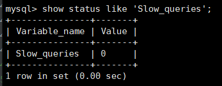
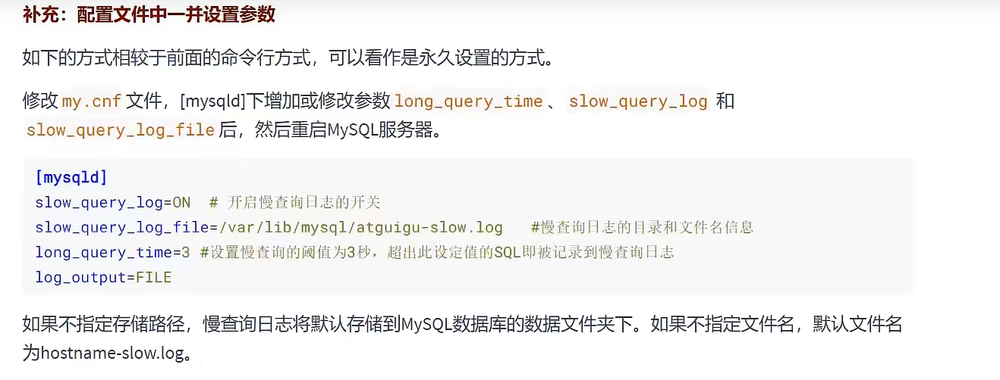

# 本章重点在索引优化和查询优化   


# 1.数据库优化步骤  
  
    
  

### 2.查看系统性能参数  
```mysql
#一个是全局的，一个是当前会话级别的
SHOW [GLOBAL|SESSION]STATUS  LIKE '参数';
```  
   
    
  
   
### 3.统计SQL的查询成本：last_query_cost  
这个查询成本对应的是SQL语句所需要读取的页的数量  
  
     

使用场景：对于比较开销是非常有用的，特别是我们有好几种查询方式可选的时候。
  

  
### 4.定位执行慢的SQL:慢查询日志
默认不开启，如果不是调优需要的话，一般不建议启动该参数，因为开启的话会带来一定的性能影响  
###### 4.1 开启慢查询日志参数  
1. 查看状态  
```mysql
show variables like '%slow_query_log';
```
  
2. 打开慢查询日志  
```mysql
set global slow_query_log = on;
```
  
3. 查看日志所在位置  
```mysql
show variables  like '%slow_query_log%';
```  
  
  

4. 设置慢查询的阈值  
  
上面的方式是临时的，重启mysql后会失效，改配置文件就能永久生效  

  
5. 查询慢查询数目 
```mysql
SHOW GLOBAL STATUS  LIKE '%Slow_queries%';
```


6. 慢查询的其他决定参数   
   


7. 慢查询日志分析工具:mysqldumpslow 定位慢查询的sql
详情看mysqldumpslow --help


8. 关闭慢查询日志  
生产当中如果不是为了调优可以关闭慢查询，因为会影响我们的性能  

    

   


9. 删除慢查询日志  
```mysql
SHOW VARIABLES LIKE 'slow_query_logs%';
```
   


   
 
# 分析查询语句 : EXPLAIN
##### 概述  
  
##### 作用  
* 表的读取顺序
* 数据读取操作的类型
* 哪些索引可以使用
* 哪些索引被实际使用
* 表之间的引用
* 每张表有多少行被优化器查询   

###### 这个操作只是去查询执行计划，并没有实际执行，只是执行计划而已，还没有做   

###### 使用  
在语句前面加EXPLAIN 
```mysql
EXPLAIN SELECT id,NAME FROM student;
```
    


# 索引优化与查询优化
大方向可以分成两大块，物理查询优化和逻辑查询优化   
* 物理查询优化是通过索引和表连接方式等技术来进行优化    
* 逻辑查询优化是通过SQL等价变换来提升查询效率


MySQL中提高性能的最有效方式是对数据表设计合理的索引，索引提供了高效访问数据的方法，并且加快查询的速度    
当然了，如果优化器觉得你用了索引更慢了那它就不会去用索引，这时候你就要思考为什么会这样     
另外： SQL语句是否使用索引，跟数据库版本，数据量，数据选择度都有关系


## 首先来看看索引失效的情况  
#### 1. 全值匹配     
建立联合索引，会快很多      
查询语句中匹配符合更多字段的索引会优先使用，字段少的就被弃用了   
#### 2. 最佳左前缀法则     
联合索引要使用要考虑把最左边的字段用上，然后再考虑下一个字段      

索引失效的第一种情况就是和这个多列索引有关系，根据最左前缀法则，从左到右应该依此匹配，如果跳过某个字段，索引后面的字段都无法被使用，如果查询条件中没有使用这些字段中第一个字段时，多列索引不会被使用   
```
阿里巴巴java开发手册里有这样一句话，索引文件具有B-Tree的最左前缀匹配特性，如果左边的值未确定，那么无法使用此索引    
```

#### 3. 主键插入顺序   
     
如果中途插入，需要页面分裂和记录移位，会带来性能损耗，比较好的处理方式是使用自增ID，AUTO_INCREMENT      

#### 4. 计算、函数、类型转换导致索引失效    


* 首先来看下哪个sql写法更好    
```mysql
#第一条
EXPLAIN  SELECT SQL_NO_CACHE * FROM student WHERE student.name LIKE 'abc%';
#第二条，LEFT()左截取3位，和第一个表达的意思相同   
EXPLAIN SELECT SQL_NO_CACHE  * from student WHERE LEFT(student.name,3) = 'abc%';


#然后我们创建索引  
CREATE INDEX  idx_name ON student(name);

```
执行之后我们发现第一个是用了索引，第二个没有用到索引采用的是全表扫描   
   
首先这两条语句的执行结果是一样的    
但是第一个我们是用得上B+树的，查a，查ab，查abc，然后锁定abc这样子，只要去查abc字段就行，而第二个就不行了，每次都要执行left再去判断匹不匹配abc，相当于每次都是从完整的池子里找新东西，而不是找到个相似的再去找其他相似的      


* 再分析下这个有计算过程的例子  
    
       
可以看到第一个语句的where部分先在字段的基础上加一再去匹配，然后导致索引失效，理由和上面的LEFT一样，做了运算之后就没办法去找后面那个值了，得一次次去找出来然后再去做运算          
这是因为索引有计算过程    

* 接着是下面这种情况，也是导致索引失效的，原因和上面的一样，无法使用上索引      
    
    

* 最后看看类型转换   
   
这里的NAME由VARCHAR转为了int，隐式使用了函数进行转换之后做对比，既然用上了函数，索引就失效了    

#### 5. 范围条件右边的列索引失效
     
但是仔细看，这个索引的key_len长度为10，age类型加default五个字节，classId也是五个，name没有用上   
这个联合索引只用了两个，当然了并不是说你写sql语句的时候把name写在classId的左边索引就不会失效了，一样会失效，这和sql的顺序没关系，索引有最左前缀匹配原则，看的是索引时先写谁后写谁      


#### 6. !=或<>导致索引失效   

#### 7. is null 可以使用 is not null 就失效  
##### 总结： 最好在设计数据表的时候就将字段设置为NOT NULL 约束，比如你可以将INT类型的字段，默认值设置为0，将字符类型的默认值设置为空字符串'' 
6和7都是因为不等于的话，都用不上B+树，只能一个个去找不等于的         
同理,在查询中使用not like 也无法使用索引，导致全表扫描     

### 8. like以通配符%开头索引失效   
阿里巴巴java开发手册强制要求，页面搜索禁止左模糊或者全模糊，如果需要请走搜索引擎来解决  


# 索引失效总结就是只要心中有B+树，这些情况都能推出来，用不到B+树的，就失效了    
