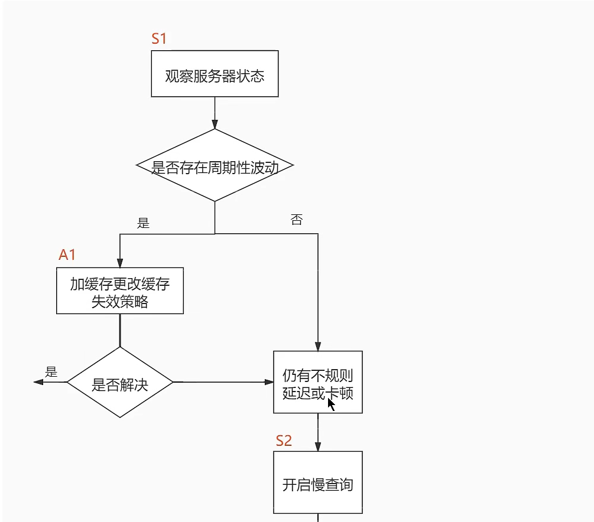
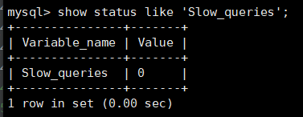
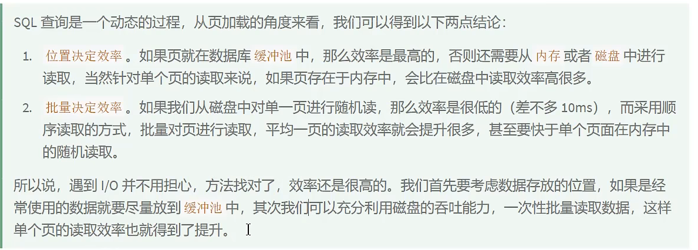
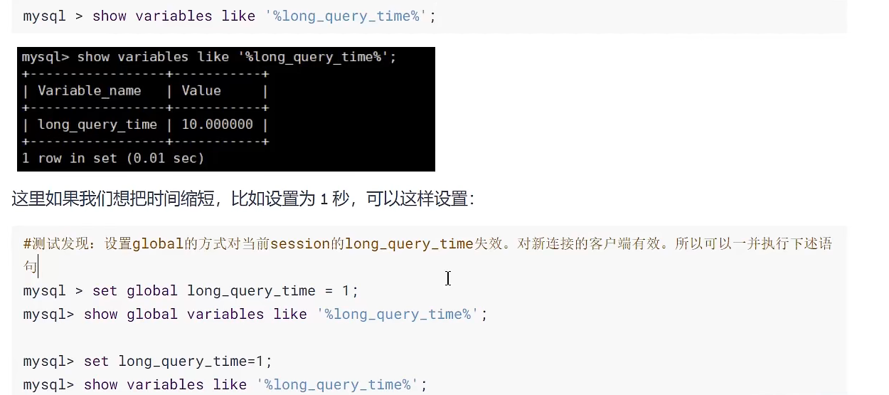

# 1.数据库优化步骤  
  
    
  

# 2.查看系统性能参数  
```mysql
#一个是全局的，一个是当前会话级别的
SHOW [GLOBAL|SESSION]STATUS  LIKE '参数';
```  
   
    
  
   
# 3.统计SQL的查询成本：last_query_cost  
这个查询成本对应的是SQL语句所需要读取的页的数量  
  
     

使用场景：对于比较开销是非常有用的，特别是我们有好几种查询方式可选的时候。
  

  
# 4.定位执行慢的SQL:慢查询日志
默认不开启，如果不是调优需要的话，一般不建议启动该参数，因为开启的话会带来一定的性能影响  
###### 4.1 开启慢查询日志参数  
1. 查看状态  
```mysql
show variables like '%slow_query_log';
```
  
2. 打开慢查询日志  
```mysql
set global slow_query_log = on;
```
  
3. 查看日志所在位置  
```mysql
show variables  like '%slow_query_log%';
```  
  
  

4. 设置慢查询的阈值  
  
上面的方式是临时的，重启mysql后会失效，改配置文件就能永久生效  

  
