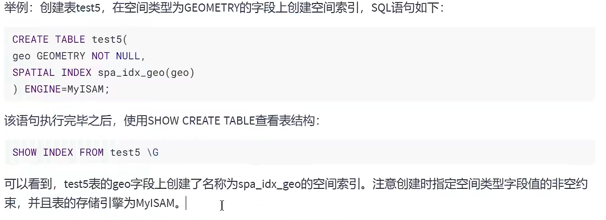

# 索引的声明与使用  
### 1.索引的分类
* 按功能逻辑上说:索引主要有4中，分别是普通索引，唯一索引，主键索引和全文索引
* 按物理实现方式:聚簇索引和非聚簇索引  
* 按作用字段个数:单列索引和联合索引
### 2.索引的创建  
1) 创建表的时候通过约束创建索引，主键约束，外键约束，唯一约束  
```mysql
CREATE TABLE dept(
    dept_id INT PRIMARY KEY AUTO_INCREMENT, 
    dept_name VARCHAR(20)
);

CREATE TABLE EMP(
    emp_id INT(10) PRIMARY KEY AUTO_INCREMENT,
    emp_name VARCHAR(20) UNIQUE,
    dept_id INT,
    CONSTRAINT emp_dept_id_fk FOREIGN KEY(dept_id) REFERENCES dept(dept_id)
);
```
2) 显示方式创建普通索引  
```mysql
CREATE  TABLE book(
    book_id INT,
    #声明索引
    INDEX 自己创建的索引名字(book_id)
);
```
通过命令查看索引    
* 方式一  
```SHOW CREATE TABLE  table 表名\G```  
  
小知识: \G可以表示;也可以使表横向输出  
* 方式二```SHOW INDEX FROM 表名;```  
  
3) 创建唯一索引  
```mysql
# 唯一索引和唯一约束是一样的，有了索引就会有约束，创建了约束也会有索引

CREATE  TABLE  book(
    COMMENT VARCHAR(100),
    UNIQUE INDEX  索引名字(COMMENT)
);
```
4) 创建主键索引  
```mysql
CREATE  TABLE  book2(
    book_id INT PRIMARY KEY AUTO_INCREMENT
);
```
5) 通过删除主键约束的方式删除主键索引  
```mysql
 ALTER TABLE 表名 DROP PRIMARY KEY; 
```
6) 创建单列索引
```mysql
CREATE TABLE book3(
    name VARCHAR(10),
    #声明索引
    UNIQUE INDEX 索引名(name)
);
```
7) 创建联合索引  
```mysql
CREATE TABLE book4(
    book_id INT,
    book_name VARCHAR(100),
    #声明联合索引
    INDEX 索引名(book_id,book_name)
);
```  
  
排序的时候先按照book_id排序，book_id相同的时候再按照book_name排序，**在查找的时候如果直接查book-name  
的话是用不到索引的**  
8) 分析索引的指令EXPLAIN
```mysql
EXPLAIN SELECT * FROM book WHERE book_id = 1001 AND book_name='mysql';
```
9) 全文索引  
**用于全文搜索，并且只为CHAR，VARCHAR，TEXT创建索引** 
```mysql
CREATE  TABLE page(
    id INT(10)  unsigned not null  auto_increment,
    title varchar(200) default  null,
    content text,
    primary key(id),
    #全文检索
    FULLTEXT KEY title(title,content)
);
```
全文检索的查询方法
```mysql
SELECT  * FROM page WHERE MATCH(title,content) AGAINST('要查询字符串');

```

全文检索比Like效率高很多  
**注意点**     
 1.可能存在精度问题  
 2.如果需要全文索引的是大量数据，建议先添加数据再创建索引  
10) 空间索引  
要求字段必须为非空  



### 3.创建表后添加索引  
1.  
```mysql
ALTER  TABLE  book ADD INDEX  索引名(列名);  
ALTER  TABLE  book ADD UNIQUE INDEX 索引名(列名);  
ALTER  TABLE  book ADD INDEX 索引名(联合索引的那几列);  
```
2.   
```mysql
CREATE  INDEX  索引名 ON book(列名);  
```


# 删除索引
1.
```mysql

ALTER  TABLE 表名 DROP INDEX 索引名;
```
**唯一索引删除不了**
2.
```mysql
DROP INDEX 索引名 ON 表名;
```

 


