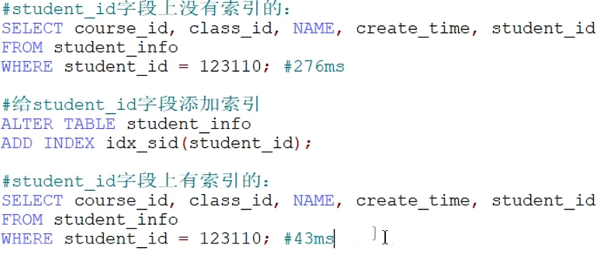
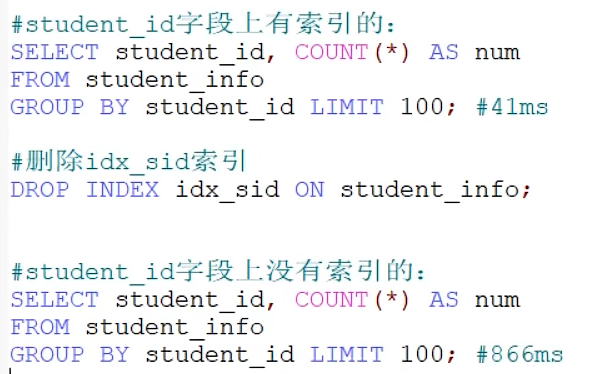
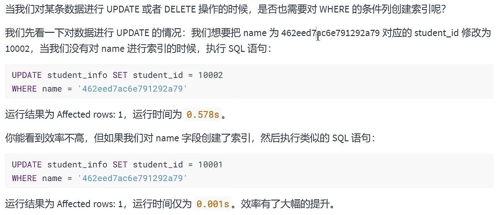
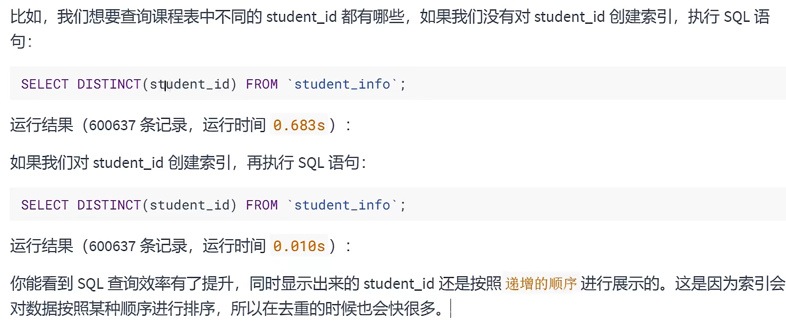
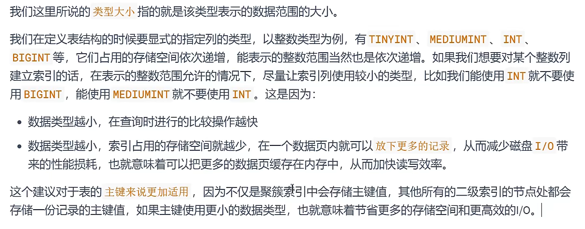
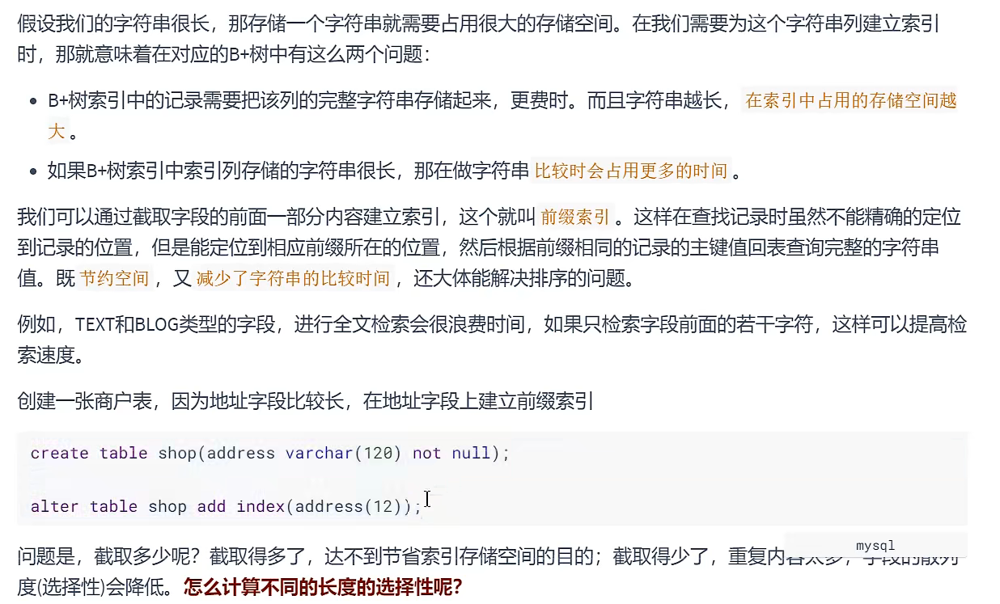
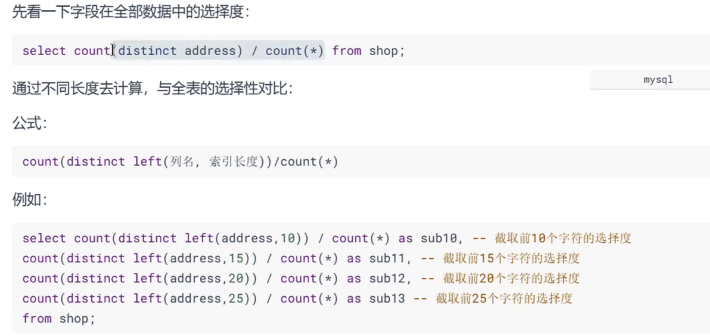
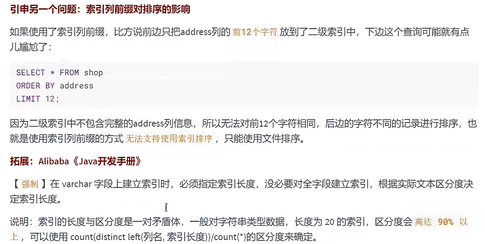
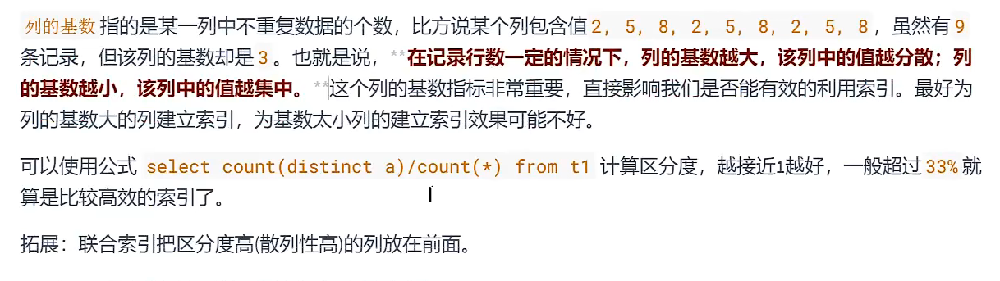

# 索引的设计原则  

## 适合加索引的情况  
###### 1.字段的数值有唯一性限制  
唯一索引，主键索引都可以起到唯一性约束，如果某个字段是唯一的，就可以直接创建唯一索引/主键索引  
例子：学生表中如果以姓名作为主键会有重名的可能性，会降低查询速度，而学号是具有唯一性的字段，所以选择学号作为唯一索引  
``
业务上具有唯一特性的字段，即使是组合字段，也必须建成唯一索引  
唯一索引对insert插入速度的影响可以忽略，而带来的查询速度的提升的明显的  
``
###### 2.频繁作为WHERE查询条件的字段  
  
可以看到对频繁查询的字段，添加索引对查询速度的提升是巨大的  

###### 3.经常 GROUP BY 和 ORDER BY的列  
``
原因：建造索引，索引本身会进行排序，对ORDER BY来说，执行的适合就不用排序了，索引自己就排好序了;  
对GROUP BY 来说，排好序再分组，也会快很多  
``
  

---
GROUP BY 和 ORDER　BY 都有的列，选择添加**联合索引**(而不是分别建立两列的索引：这里花费5s),查询速度会飞跃提升    
  
查询时间从5s缩短为0.257s，可以看到这是飞跃的提升  

**注意！！！**  
如果联合索引是ORDER BY的字段放前面，GROUP BY的字段放后面，则查询的时候就用不到这个联合索引了，而用的是GROUP BY这个字段的索引，  
因为GROUP BY先执行，GROUP BY这个线程先用了这个字段的索引  

所以说如果查询语句既有GROUP BY 又有ORDER BY，则添加联合索引的时候，一定要将GROUP BY的字段写在前面
######  4.UPDATE、DELETE、WHERE条件列    
    
如果进行更新的时候，更新的字段是非索引字段，提升的效率更明显，这是因为非索引字段更新不需要对索引进行维护  

###### 5.DISTINCT字段需要创建索引  
  

###### 6.多表JOIN连接操作时，创建索引注意事项  
1.连接表的数量尽量不要超于3张，因为每多一张就增加了一次嵌套的循环  
2.对Where条件创建索引  
3.对用于连接的字段创建索引，并且该字段在多张表中的类型必须一致   

###### 7.使用列的类型小的创建索引   
    
###### 8.使用字符串前缀  
  
  
  

###### 9.区分度高(散列性高)的列适合作为索引  

###### 10. 使用最频繁的列放在联合索引的左侧   
这样可以较少的建立一些索引，同时，由于最左前缀原则，可以增加联合索引的使用率

###### 11.在多个字段都要创建索引的情况下，联合索引优于单值索引  
联合索引可以用于单值的索引，一个联合索引可能会被用到很多地方

##### 限制索引的数目  
在实际工作中，我们也要注意平衡，建议单张表索引数量不超过6个，原因如下：  
1)索引占用磁盘空间  
2)会影响INSERT、DELETE、UPDATE等语句的性能，数据更改的时候，索引也要调整和更新  
3)优化器在选择如何优化查询时，会对每一个可以用到的索引进行评估，以生成一个最好的执行计划，如果同时有很多索引都可以用于查询，则会增加MySQL优化器生成执行计划时间，降低查询性能  

## 不适合加索引的情况  
###### 1.在Where中使用不到的字段 
###### 2.数据量小的表最好不要使用索引(低于1000条)  
###### 3.有大量重复数据的列上不要建立索引  
###### 4.避免对经常更新的表创建过多的索引  
第一层含义：频繁更新的表不一定要创建索引，更新表的时候也要更新索引，影响效率    
第二层含义：避免对经常更新的表创建过多的索引，并且索引中的列尽可能少  
###### 5.不建议使用无序的值作为索引  
例如身份证，UUID(在索引比较时需要转为ASCII，并且插入时可能造成页分裂)  
###### 6. 删除不再使用或者很少使用的索引  
###### 7.不要定义冗余或重复的索引  
 ①冗余:index(a,b,c)相当于index(a)、index(a,b)、index(a,b,c)    
 ②重复:对某个列重复建立索引  

