# 锁  

### 简介
    


### 并发事务访问相同记录的情况     
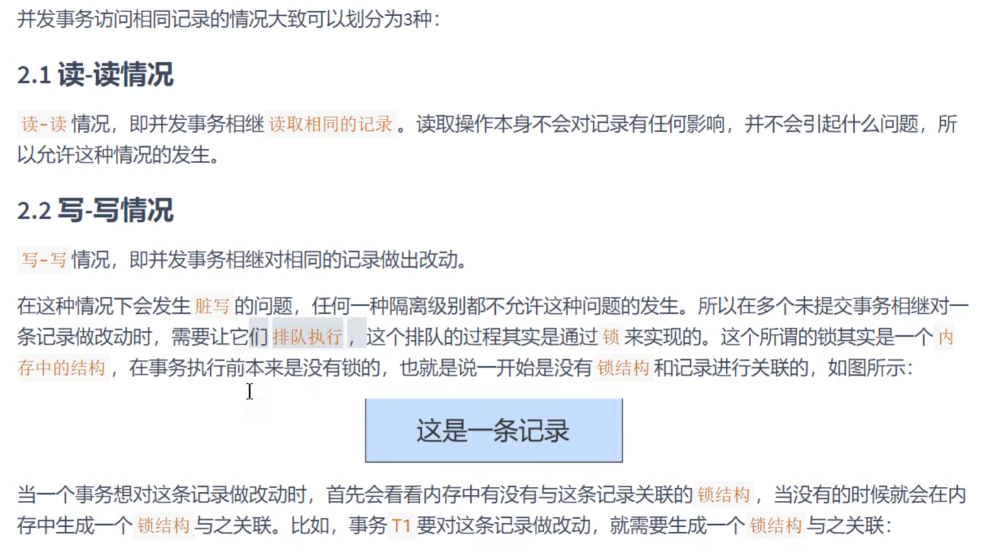    

    


    


    
   

这种情况，事务访问相同记录，需要排队等待正在执行的事务，执行完后才到他   

    

    


     

    
     


# 锁的分类   

    


### 数据操作类型划分   
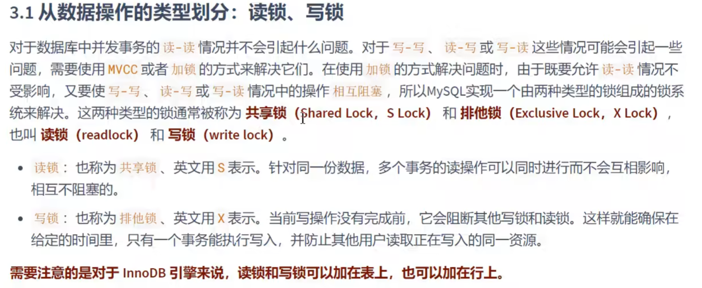     

MYISAM只能表锁      


   


   

    

   

    


   


### 数据操作粒度划分:表级锁，页级锁，行锁   
 

## 表级别的锁： ①写锁和读锁
    

    


加锁代码：   
    
解锁就是unlock 表名   

   


```mysql
LOCK TABLES 表名 READ
LOCK TABLES 表名 WRITE
```
实际开发中，只是加表级锁的话，一般都是用MyISAM，而不是InoDB   
    

## 表级别的锁②：意向锁  
   


  


     

给行加锁是不会与意向锁冲突的    


    


   


## 表锁③：自增锁，了解就好   
    

    


   

  


   


## 表锁④  元数据锁（MDL）
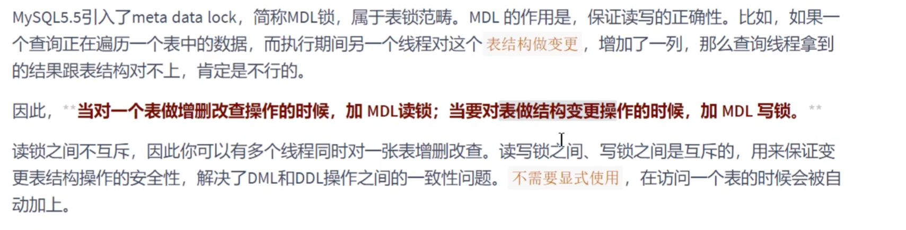   


# 行锁   
   

### ① 记录锁  

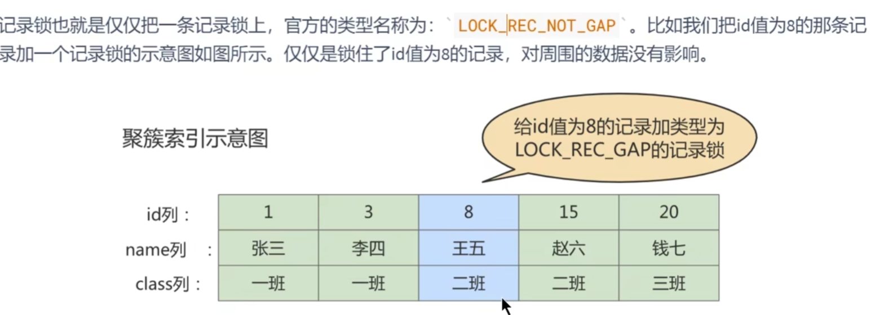    
   


### ② 间隙锁   
   
这个可重复读隔离级别本身是不能解决的，但是在这基础上可以用MVCC或者间隙锁解决，图片第一行的意思有点歧义    
    


     

   

间隙锁是不分X、S锁的，gap读和写锁作用相同，每个服务都能加间隙锁，唯一影响的是，如果有一个新的服务要插入间歇范围中的数据，就无法插入，就可以避免幻读了   

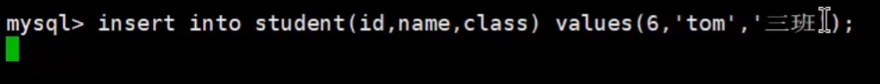   
可以看到无法插入   


举例   
   

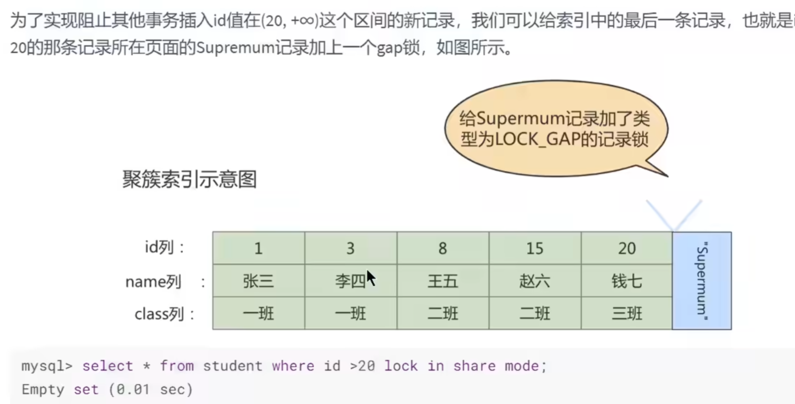    


可以检测下这个Supremum是否存在   
    

   


#### 间隙锁可能会导致死锁问题   
两个线程都有间隙锁   

   
    
可能出现下图死锁的场景       
   


A B都有间隙锁，A插入的时候被B的间隙锁阻塞，B插入的时候被A的间隙锁阻塞，然后正常逻辑来说想解开就需要A把锁去掉        
或者B把锁去掉，但是A，B都不能去掉，因为他们本身线程都停止在插入语句下了，插入语句都一直没执行完，无法去释放锁      


当然mysql自己有解决方案  
     


也不单是间隙锁，只要是行锁都可能会出现死锁问题，表锁就不会出现    


### 行锁③ ： 临键锁  

    
    

    

当你其他线程要插入的时候就会阻塞   
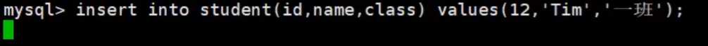    
   
### 行锁④ ： 插入意向锁   

    


    


## 页锁   (了解就好了，INNODB一般是用行锁，MyISAM只能表锁)

页锁的粒度是介于表锁和行锁之间的。性能开销也是   

     


# 从锁的态度划分：乐观锁和悲观锁  

## 悲观锁   
   


秒杀案例1：  下面以超卖（100个物品，卖了101个，库存为"负“)举例说明悲观锁        
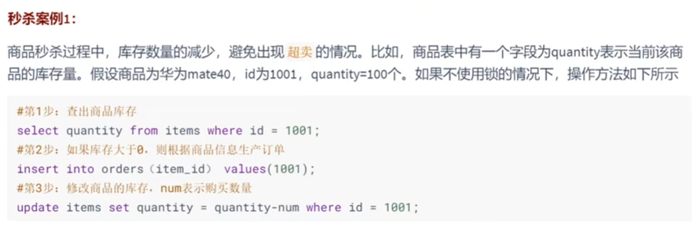    
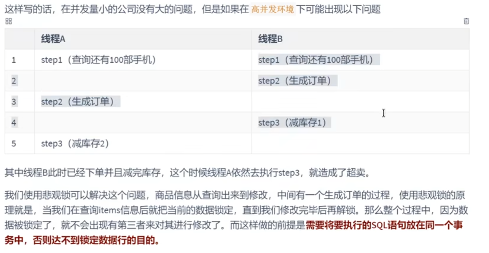      
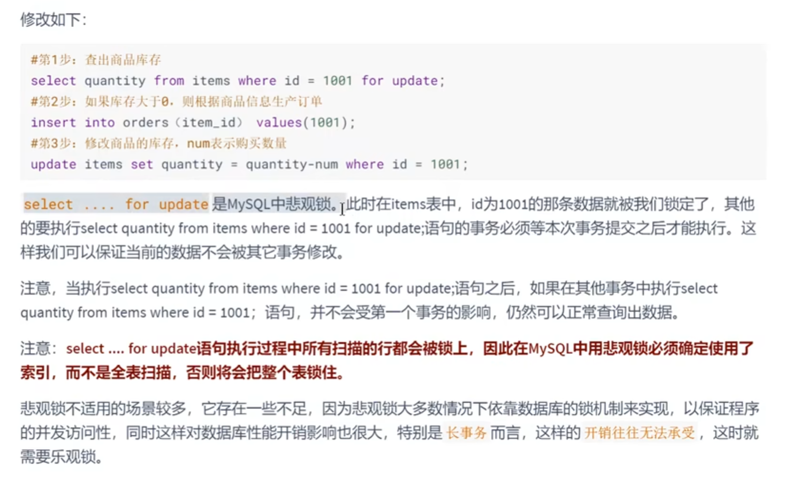      

对老师讲的这个for update的争议说法
    


尽量where过滤条件的列是有索引的，不然就是加表锁了   


## 乐观锁   
    

和java并发编程串起来了，怪不得面试官喜欢考锁   


    


    

秒杀案例2 ：   

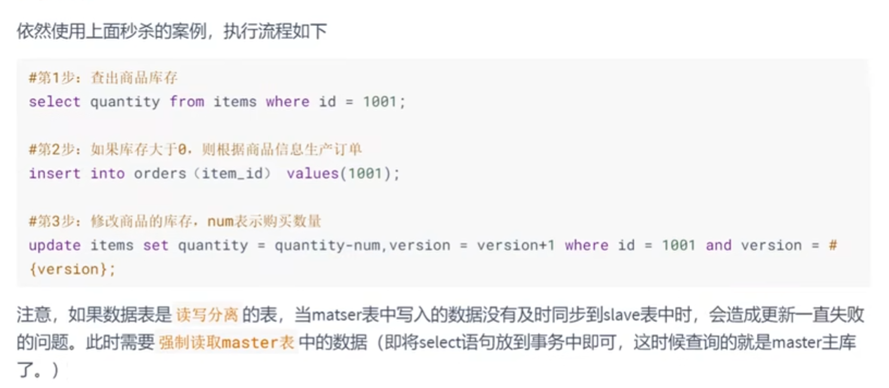   
注意主从复制的问题，更新到从机上是有延迟的，不能因为延迟问题而不能更新，所以强制读取主master机器的数据表   

问题二：   
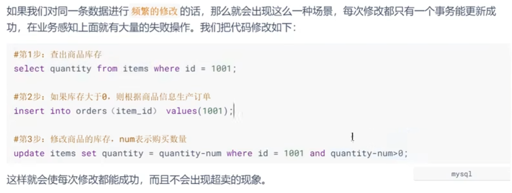    

我觉得这里应该是quantity-num >= 0   

update自带X锁  

讲解下，这个确实是可以解决超卖的，B事务不提交，update的写锁就不会释放，那么A要update就会直接阻塞，到不了where条件判断句子了，直接阻塞了，也就不存在说发现库存ok也去消费，然后导致超卖问题了    

真实秒杀其实不会直接用mysql做的     

### 总结   
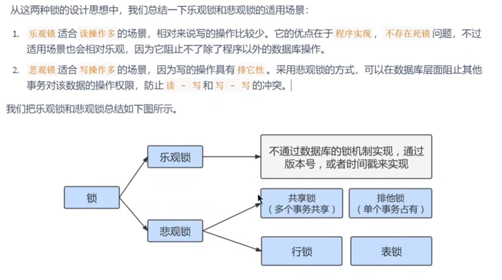   


