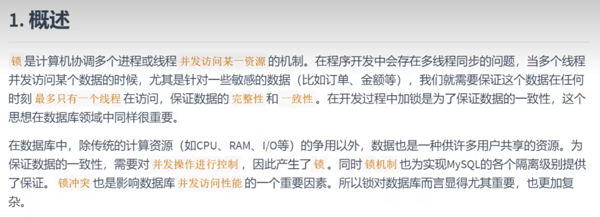
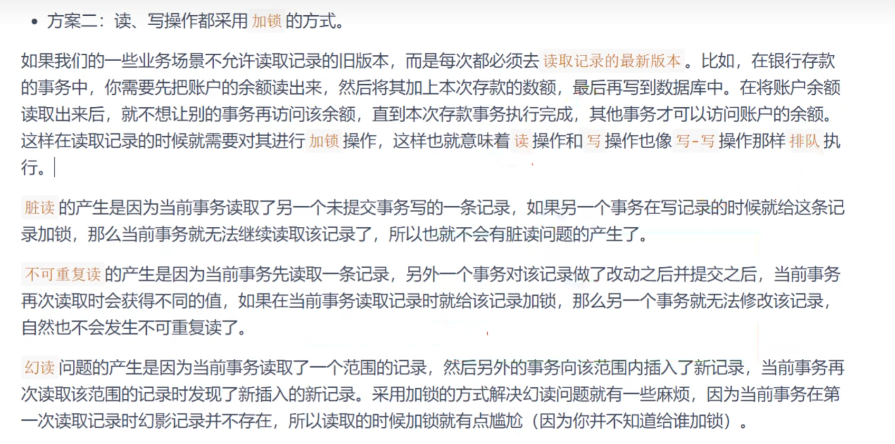
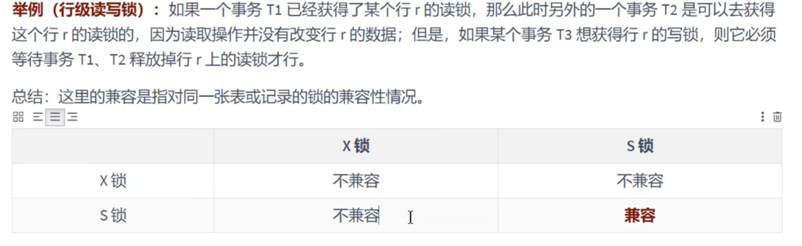
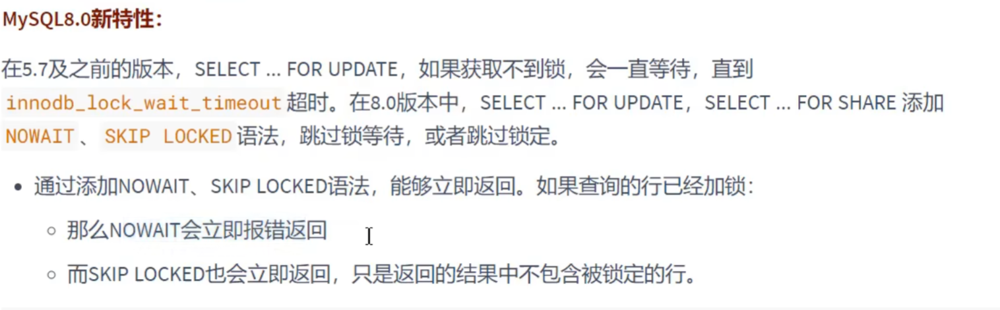
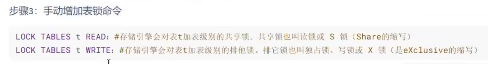

# 锁  

### 简介
    

### 并发事务访问相同记录的情况     
    

    

    

    
 

这种情况，事务访问相同记录，需要排队等待正在执行的事务，执行完后才到他   

    

    

     

    
     

# 锁的分类   

    

### 数据操作类型划分   
     

MYISAM只能表锁      

   

   

    

   

    

   

### 数据操作粒度划分:表级锁，页级锁，行锁   
 
    

    

加锁代码：   
    
解锁就是unlock 表名   

   

